# deflation-precond-strategies-sde

#### Enables testing and applications of deflation and preconditioning strategies to solve sequences of sampled finite element (FE) discretizations of stochastic differential equations (SDE).

Author: Nicolas Venkovic

email: [venkovic@cerfacs.fr](mailto:venkovic@cerfacs.fr)

_TeX expressions rendered by [TeXify](https://github.com/apps/texify)._

### Dependencies:

 - *Python* (2.x >= 2.6)
 - *SciPy* (>= 0.11)
 - *NumPy* (>= 1.6)

### Files' content:

Files: _samplers.py_, _samplers_etc.py_, _solvers.py_, _solvers_etc.py_, _recyclers.py_, _post_recyclers.py_.

Classes: `sampler`, `solver`, `recycler`.


___

_samplers.py_ : 

Signature : `sampler`(`nEL`=`500`,`smp_type`=`"mc"`, `model`=`"SExp"`, `sig2`=`1`, `mu`=`0`, `L`=`0.1`, `vsig2`=`None`,`delta2`=`1e-3`, `seed`=`123456789`, `verb`=`1`, `xa`=`0`, `xb`=`1`, `u_xb`=`None`, `du_xb`=`0`)

Assembles sampled operators in a sequence $\{\mathbf{A}(\theta_t)\}_{t=1}^M$ for the stochastic system $\mathbf{A}(\theta)\mathbf{u}(\theta)=\mathbf{b}$ of a P0-FE discretization of the SDE $\partial_x[\kappa(x;\theta)\partial_xu(x;\theta)]=-f(x)$ for all $x\in(x_a, x_b)$ and $u(x_a)=0$. The stationary lognormal coefficient field $\kappa(x;\theta)$ is represented by a truncated Karhunen-Loève (KL) expansion later sampled either by Monte Carlo (MC) or by Markov chain Monte Carlo (MCMC).

- `nEl` (`int`, `nEl`>`0`) : Number of elements.

- `smp_type` (`string`, {`"mc"` , `"mcmc"`}) : Sampling strategy of the KL expansion.

- `model` (`string`, {`"SExp"`, `"Exp"`}) : Covariance model.

  `"SExp"` : Square exponential model.

  `"Exp"` : Exponential model.

- `sig2` (`float`, `sig2`>`0`) : Variance.

- `mu` (`float`) : Mean.

- `L` (`float`, `L`>`0`) : Correlation length.

- `delta2` (`float`, `0`<`delta2`<`1`) : Tolerance for the relative error in variance of the truncated KL representation. Used to evaluate the number `nKL`<`nEL` of terms kept in the expansion.

- `seed` (`int`, `seed`>=`0`) : RNG seed.

- `verb` (`int`, {`0`,`1`, `2`}) : Verbose parameter.

  - `0` : No standard output, new KL expansion not saved.
  - `1` : No standard output, new KL expansion saved in file.
  - `2` : Basic standard output, new KL expansion saved in file.

- `vsig2` (`float`, `vsig2`>`0`) : Variance of the random walk for the proposal of the MCMC sampler. If `None`, eventually set to `2.38**2/nKL`.

- `xa`, `xb` (`float`, `xa`<`xb`) : Domain extent.

- `u_xb`, `du_xb` (`float`) : $u(x_b)$ and $\partial_xu(x_b)$. `u_xb` must be `None` if `du_xb`!=`None`. `du_xb` must be `None` if `u_xb`!=`None`.

  Public methods : `compute_KL`(`self`), `draw_realization`(`self`), `do_assembly`(`self`), `get_kappa`(`self`), `get_median_A`(`self`).


___

_solvers.py_ :

Signature : `solver`( `n`, `solver_type`, `eps`=`1e-7`, `itmax`=`2000`, `W`=`None`, `ell`=`0`)

Solves a linear system iteratively and potentially recycles some information about a Krylov subspace.

- `n` (`int`, `n`>`1`) : System size.
- `solver_type` (`string`, {`"cg"`, `"pcg"`, `"dcg"`, `"dpcg"`}) : Type of iterative solver.
  - `cg` : Conjugate gradient.
  - `pcg` : Preconditioned conjugate gradient.
  - `dcg` : Deflated conjugate gradient.
  - `pdcg` : Preconditioned deflated conjugate gradient.
- `eps` (`float`, `0`<`eps`<`1`) : Tolerance used for the stopping criterion based on the backward error of the RHS. Iterations are stopped if the norm `iterated_res_norm` of the iterated residual `r` is such that `iterated_res_norm`<`eps`*`bnorm` where `bnorm` denotes $\|b\|$.
- `itmax` (`int`, `itmax`>`1`) : Maximum number of iterations.
- `W` (`ndarray`, `W.shape`=`(n,k)`, `k`<`n`) : Basis of deflation subspace used for `"dcg"` and `"dpcg"`.
- `ell` (`int`, `ell`>`0`) : Attempted dimension of the Krylov subspace to recycle.


  Public methods : `set_precond`, `presolve`, `apply_invM`, `solve`.

  Signature : `set_precond`(`self`, `Mat`, `precond_id`, `nb`=`2`, `application_type`=`1`)

 - `	Mat` ({`ndarray`, `sparse`}, `Mat.shape`=`(n, n)`) : Array used to define a preconditioner.

  - `precond_id` (`int`, {`1`, `2`, `3`}) : Preconditioner ID: 

    `1` : Preconditioner is `Mat`.

    `2` : Precondiotioner is an algebraic multi-grid (AMG) solver of a system defined with `Mat`.

    `3` : Preconditioner is Block Jacobi (bJ) based on `Mat` with `nb` (non-overlapping) blocks.

  - `nb` (`int`, `0`<`nb`<`n`) : Number of blocks for the bJ preconditioner, only used for `precond_id`=`3`.

  - `application_type` (`int`, {`0`, `1`, `2`}) : Way the inverse preconditioner is applied. Does not apply for `precond_id` =`2`.

    `0` : Resolution of a linear system from scratch using an appropriate solver each time the inverse preconditoner is applied. Apply inverse preconditioner to `x` as follows:

    - `Mat` is `ndarray` : `scipy.linalg.solve`(`M`, `x`).
    - `Mat` is `sparse` : `scipy.sparse.linalg.spsolve`(`M`, `x`).

    `1` : An appropriate  factorization is computed and stored when `set_precond` is called. Then, the factorization is used each time the inverse preconditoner is applied.

    - `Mat` is `ndarray` : Factorize `M` with `scipy.linalg.cho_factor`(`M`, `x`).
    - `Mat` is `sparse` : Factorize `M` with `scipy.sparse.linalg.factorized`(`M`, `x`).

    `2` : The array of the inverse preconditioner is explicitly computed when `set_precond` is called. The computed inverse is later applied as a matrix-vector product at each application.

  Signature : `presolve`(`self`, `A`, `b`, `ell`=`0`)

  If `self.type`={`"dcg"`, `"dpcg"`} : Computes $AW$ and computes/factorizes $W^TAW$.

  - `A` ({`ndarray`, `sparse`}, `A.shape`=`(n, n)`) : Sampled operator of linear system to solve.
  - `b` (`ndarray`, `b.shape`=`(n,)`) : Right hand side.
  - `ell` (`int`, `ell`>=`0`) : Dimension of Krylov subspace to recycle

  Signature : `apply_invM`(`self`, `x`)

- `x` (`ndarray`, `x.shape`=`(n,)`) : Vector.

  Signature : `solve`(`self`, `x0`, `x_sol`=`None`)

  - `x0` (`ndarray`, `x0.shape`=`(n,)`) : Initial iterate.
  - `x_sol` (`ndarray`, `x_sol.shape`=`(n,)`) : Exact solution used to compute A-norm errors.


___

_recyclers.py_ : 

Signature : `recycler`(`sampler`, `solver`, `recycler_type`, `dt`=`0`, `t_end_def`=`0`, `kl`=`5`, `kl_strategy`=`0`, `t_end_kl`=`0`, `ell_min`=`0`, `dp_seq`=`"pd"`, `which_op`=`"previous"`, `approx`=`"HR"`)

Interfaces a `sampler` with a `solver` in order to solve a sequence of linear systems $\mathbf{A}(\theta_t)\mathbf{u}(\theta_t)=\mathbf{b}$  associated with a sequence of sampled operators $\{\mathbf{A}(\theta_t)\}_{t=1}^M$. The recyclers implemented make use of preconditioners and/or deflation of Krylov subspaces. 

The available sequences of preconditioners $\{\mathbf{M}(\theta_t)\}_{t=1}^M$ are either: (1) constant, i.e.  $\mathbf{M}(\theta_t)=\mathbf{M}(\hat{\mathbf{A}})$ for all $t$, where $\hat{\mathbf{A}}$ denotes the median operator, or (2) realization-dependent and redefined periodically throughout the sampled sequence, i.e. $\mathbf{M}(\theta_t):=\mathbf{M}(\theta_{t_j})$ for all $t_j\leq t<t_{j+1}$ with $t_j:=1+j\Delta t$ and $0\leq j<M/\Delta t$ for some period $\Delta t$.  All the preconditioners available are SPD so that for each $\mathbf{M}(\theta_t)$, there exists $\mathbf{L}(\theta_t)$ such that $\mathbf{M}(\theta_t)=\mathbf{L}(\theta_{t})\mathbf{L}(\theta_{t})^{T}$.

Deflation is performed either: (1) throughout the sequence, or (2) for all $t\leq t_{stop}$ for some $t_{stop}\leq M$. The Krylov subspace $\mathcal{K}^{(t)}$ associated with the iterative resolution of $\mathbf{A}(\theta_t)\mathbf{u}(\theta_t)=\mathbf{b}$  is deflated by a subspace $\mathcal{W}(\theta_t):=\mathcal{R}(\mathbf{W}(\theta_t))$ spanned by $\mathbf{W}(\theta_t):=[\mathbf{w}_1(\theta_t),\dots,\mathbf{w}_k(\theta_t)]$. $\{\mathbf{w}_k(\theta_t)\}_{j=1}^k$ are approximate eigenvectors of either $\mathbf{A}(\theta_{t-1})$, $\mathbf{A}(\theta_t)$, $\mathbf{M}^{-1}(\theta_{t-1})\mathbf{A}(\theta_{t-1})$ or $\mathbf{M}^{-1}(\theta_{t})\mathbf{A}(\theta_{t})$ depending on the deflation strategy adopted and whether a preconditioner is used or not.

The approximated eigenvectors $\mathbf{w}_1(\theta_t),\dots,\mathbf{w}_k(\theta_t)$ are obtained by (1) Harmonic Ritz, and/or (2) Rayleigh Ritz analysis over an approximation subspace $\mathcal{R}([\mathbf{W}(\theta_{t-1}),\mathbf{P}(\theta_{t-1})])$ spanned by a (recycled) basis $\mathbf{P}(\theta_{t-1})\in\mathbb{R}^{n\times\ell}$ of the Krylov subspace $\mathcal{K}^{(t-1)}_{\ell}\subseteq\mathcal{K}^{(t-1)}$, and the basis $\mathbf{W}(\theta_{t-1})\in\mathbb{R}^{n\times k}$ of a deflation subspace $\mathcal{W}^{(t-1)}\perp\mathcal{K}^{(t-1)}$. The dimensions $k$ and $\ell$ are respectively denoted by `kdim` and `ell` throughout the code.

- `sampler` (`sampler`) 
- `solver` (`solver`) 
- `recycler_type` (`string`, {`"pcgmo"`, `"dcgmo"`, `"dpcgmo"`}) : Type of recycling or preconditioning strategy used to solve the sampled sequence of linear systems. Needs to be compatible with `solver.type` and `sampler.type`. Valid combinations are : 
  - `sampler.type`=`"mcmc"` ; `solver.type`=`"pcg"` ; `recycler-type`=`"pcgmo"`.
  - `sampler.type`={`"mc"`, `"mcmc"`} ; `solver.type`= `"dcg"` ; `recycler-type`= `"dcgmo"`.
  - `sampler.type`={`"mc"`, `"mcmc"`} ; `solver.type`= `"dpcg"` ; `recycler-type`= `"dpcgmo"`.
- `dt` (`int`, `dt`>=`0`) : Renewal period of the preconditioner used for `"pcgmo"`.  If `dt`=`0`, there is no renewal, i.e. the preconditioner is constant throughout the sequence.
- `t_end_def` (`int`, `t_end_def`>=`0`) : Number of realizations (resp. distinct realizations for `sampler.type`=`"mcmc"`) beyond which the deflation subspace is not updated any more. For`t_end_def`=`0` , there is no interruption and a new deflation subspace is generated at each  (resp. distinct) realization.
- `kl` (`int`, `kl`>=`0`) : Upper bound on the sum of the dimensions `kdim`  and `ell` of the deflation and recycled Krylov subspaces, respectively.
- `kl_strategy` (`int`, {`0`, `1`}) : Strategy used to update the dimensions `kdim`  and `ell` of the deflation and recycled Krylov subspaces, respectively, at each (resp. distinct) realizations in the sampled sequence.
  - `0` : First, `kdim`=`0` and `ell`=`kl`. Starting at the second realization, `kdim` and `ell` are kept as constant as possible with values `kdim`=`kl`/2 and `ell`=`kl`-`kdim`.
  - `1` : First, `kdim`=`0` and `ell`=`kl`. Starting at the second realization, `ell` is decreased at constant rate from `kl` to reach `ell_min` by the `t_end_kl`-th realization.
  - `2` : First, `kdim`=`0` and `ell`=`kl`. Starting at the second realization, `kdim`<  `ell` approximate eigenvectors are selected, at each realization, that satisfy a criterion given on the eigenresidual.
- `t_end_kl` (`int`, `t_end_kl`>`0`) : Number of sampled realizations before `ell` reaches `ell_min`, used only for `kl_strategy`=`1`.
- `ell_min` (`int`, `ell_min`>=`0`) : Minimum dimension of recycled Krylov subspaces, used only for `kl_strategy`=`1`.
- `dp_seq` (`string`, {`"pd"`, `"dp"`}) : Deflation-preconditioning sequence for `"dpcgmo"` :
  - `"pd"` : Precondition after deflating.
  - `"dp"` : Deflate after preconditioning.
- `which_op` (`string`, {`"previous"`, `"current"`}) : Operator whose eigenvectors are approximated to construct a deflation subspace to be used for a current linear system : 
  - `"previous"` : Previous (resp. last distinct) operator in the sequence.
  - `"current"` : Current operator.
- `approx` (`string`, {`"HR"`, `"RR"`}) : Method used for the eigenvector approximation :
  - `"HR"` : Harmonic Ritz analysis---best suited to approximate least dominant LD eigenpairs.
  - `"RR"` : Rayleigh Ritz analysis---best suited to approximate most dominant MD eigenpairs.


  Public methods : `do_assembly`, `prepare`, `solve`.

  Signature `do_assembly`(`self`)

  Assembles current operator $A$ from sampled realization.

  Signature `prepare `(`self`)

  If `self.type`=`"pcgmo"` : Updates preconditioner and computes new factorization.

  If `self.type`={`"dcgmo"`, `"dpcgmo"`} : Updates deflation subspace, computes $AW$, and computes/factorizes $W^TAW$.

  Signature : `solve`(`self`, `x0`)

  Solves the current system in the the sequence.

  - `x0` (`ndarray`, `x0.shape`=`(n,)`) : Initial iterate, later projected onto the orthogonal complement of the deflation subspace if `self.type`={`"dcgmo"`, `"dpcgmo"`}.


___


### Usage:

Examples:

- _example00_sampler.py_ : Use of the `sampler` class to sample by MC and MCMC.
- _example01_solver.py_ : Use of the `solver` class to solve MC and MCMC sampled sequences of systems by PCG.
- _example02_solver_mcmc_overhead_ergodic.py_ : Quantification of overhead due to MCMC sampling.
- _example03_recycler.py_ : Use of the `recycler` class to solve a MCMC sampled sequences of systems by PCGMO using constant and realization-dependent preconditioners. 
- _example04_recycler.py_ : Series of DCGMO results for sequences of systems sampled by MC and by MCMC.
- _example05_recycler.py_ : Series of DPCGMO results for sequences of systems sampled by MC and by MCMC.


___

#### Example #0: example00_sampler.py

Draws and plots realizations of the lognormal coefficient field $\kappa(x;\theta)$ with an exponential covariance sampled by Monte Carlo, and by Markov chain Monte Carlo.  

```python
import sys; sys.path += ["../"]
from samplers import sampler
import pylab as pl

figures_path = '../figures/'

nEl = 1000
nsmp = 50
sig2, L = .357, 0.05
model = "Exp"

mc = sampler(nEl=nEl, smp_type="mc", model=model, sig2=sig2, L=L)
mc.compute_KL()

mcmc = sampler(nEl=nEl, smp_type="mcmc", model=model, sig2=sig2, L=L)
mcmc.compute_KL()

fig, ax = pl.subplots(1, 2, sharey=True, figsize=(8,3.7))
for i_smp in range(nsmp):
  mc.draw_realization()
  ax[0].plot(mc.get_kappa(), lw=.1)

while (mcmc.cnt_accepted_proposals <= nsmp):
  mcmc.draw_realization()
  if (mcmc.proposal_accepted):
    ax[1].plot(mcmc.get_kappa(), lw=.1)
ax[0].set_ylabel("kappa(x;theta_t)")
ax[0].set_xlabel("x"); ax[1].set_xlabel("x")
ax[0].set_title("MC sampler")
ax[1].set_title("MCMC sampler")
#pl.show()
pl.savefig(figures_path+"example00_sampler.png")
```


__Results:__ 


___

#### Example #1: example01_solver.py

Solves $\partial_x[\kappa(x;\theta)\partial_xu(x;\theta)]=-f(x)$ for all $x\in(x_a, x_b)$ with $u(x_a)=0$ and $u(x_b)=0.005$. The sequence $\{\kappa(x;\theta_t)\}_{t=1}^M$ is sampled by Monte Carlo, and by Markov chain Monte Carlo.  In both cases, the corresponding sequence $\{u(x;\theta_t)\}_{t=1}^M$ is obtained after FE discretization and PCG resolutions using a block Jacobi (bJ) preconditioner based on the median operator with 10 blocks.

```python
import sys; sys.path += ["../"]
from samplers import sampler
from solvers import solver
import numpy as np
import pylab as pl

figures_path = '../figures/'

nEl = 1000
nsmp = 50
sig2, L = .357, 0.05
model = "Exp"

mc = sampler(nEl=nEl, smp_type="mc", model=model, sig2=sig2, L=L, u_xb=0.005, du_xb=None)
mc.compute_KL()

mcmc = sampler(nEl=nEl, smp_type="mcmc", model=model, sig2=sig2, L=L, u_xb=0.005, du_xb=None)
mcmc.compute_KL()

pcg = solver(n=mc.n, solver_type="pcg")
pcg.set_precond(Mat=mc.get_median_A(), precond_id=3, nb=10)

fig, ax = pl.subplots(2, 3, figsize=(13,8.))
for i_smp in range(nsmp):
  mc.draw_realization()
  mc.do_assembly()
  pcg.presolve(A=mc.A, b=mc.b)
  pcg.solve(x0=np.zeros(mc.n))
  ax[0,0].plot(mc.get_kappa(), lw=.1)
  ax[0,1].plot(pcg.x, lw=.2)
  ax[0,2].semilogy(pcg.iterated_res_norm/pcg.bnorm, lw=.3)  
ax[0,0].set_title("kappa(x; theta_t)")
ax[0,1].set_title("u(x; theta_t)")
ax[0,2].set_title("||r_j||/||b||")
ax[0,0].set_ylabel("MC sampler")

while (mcmc.cnt_accepted_proposals <= nsmp):
  mcmc.draw_realization()
  if (mcmc.proposal_accepted):
    pcg.presolve(A=mcmc.A, b=mcmc.b)
    pcg.solve(x0=np.zeros(mcmc.n))
    ax[1,0].plot(mcmc.get_kappa(), lw=.1)
    ax[1,1].plot(pcg.x, lw=.2)
    ax[1,2].semilogy(pcg.iterated_res_norm/pcg.bnorm, lw=.3)  
ax[1,0].set_xlabel("x"); ax[1,1].set_xlabel("x"); ax[1,2].set_xlabel("Solver iteration, j")
ax[1,0].set_ylabel("MCMC sampler")
pl.show()
#pl.savefig(figures_path+"example02_solver.png", bbox_inches='tight')
```


__Results:__


___

#### Example #2: example02_solver_mcmc_overhead_ergodic.py

mcmc overhead.

```python
import sys; sys.path += ["../"]
from samplers import sampler
from solvers import solver
import numpy as np
from example02_solver_mcmc_overhead_ergodic_plot import *

nEl = 1000
nsmp_mcmc = 1e7
nsmp_mc = 1e5

model = "SExp"

prms = [{"sig2":0.05, "L":0.02}, {"sig2":0.50, "L":0.02}, 
        {"sig2":0.05, "L":0.20}, {"sig2":0.50, "L":0.20}]

u_xb_mc, u_xb_mcmc, ratio = {}, {}, {}
cov_u_xb_mc, cov_u_xb_mcmc = {}, {}

for case in range(4):
  sig2, L = prms[case]["sig2"], prms[case]["L"]
  _case = (sig2, L)
  print _case, "mc"
  u_xb_mc[_case] = load_u_xb(sig2, L, model, "mc")
  if isinstance(u_xb_mc[_case], bool):
    u_xb_mc[_case] = np.zeros(nsmp_mc)
    mc = sampler(nEl=nEl, smp_type="mc", model=model, sig2=sig2, L=L, u_xb=None, du_xb=0)
    mc.compute_KL()
    pcg = solver(n=mc.n, solver_type="pcg")
    pcg.set_precond(Mat=mc.get_median_A(), precond_id=1)
    for i_smp in range(nsmp_mc):
      mc.draw_realization()
      mc.do_assembly()
      pcg.presolve(A=mc.A, b=mc.b)
      pcg.solve(x0=np.zeros(mc.n))
      u_xb_mc[_case][i_smp] = pcg.x[-1]
    save_u_xb({"u":u_xb_mc[_case]}, sig2, L, model, "mc")
  fft_u_xb = np.fft.fft(u_xb_mc[_case]-u_xb_mc[_case].mean())
  cov_u_xb_mc[_case] = np.real(np.fft.ifft(fft_u_xb*np.conjugate(fft_u_xb))/nsmp_mc)

  print _case, "mcmc"
  u_xb_mcmc[_case], ratio[_case] = load_u_xb(sig2, L, model, "mcmc")
  if isinstance(u_xb_mcmc[_case], bool):
    u_xb_mcmc[_case] = np.zeros(nsmp_mcmc)
    mcmc = sampler(nEl=nEl, smp_type="mcmc", model=model, sig2=sig2, L=L, u_xb=None, du_xb=0)
    mcmc.compute_KL()
    pcg = solver(n=mcmc.n, solver_type="pcg")
    pcg.set_precond(Mat=mcmc.get_median_A(), precond_id=1)  
    for i_smp in range(nsmp_mcmc):
      mcmc.draw_realization()
      mcmc.do_assembly()
      if (mcmc.proposal_accepted):
        pcg.presolve(A=mcmc.A, b=mcmc.b)
        pcg.solve(x0=np.zeros(mcmc.n))
      u_xb_mcmc[_case][i_smp] = pcg.x[-1]
    ratio[_case] = mcmc.cnt_accepted_proposals/float(mcmc.reals)
    save_u_xb({"u":u_xb_mcmc[_case], "ratio":ratio[_case]}, sig2, L, model, "mcmc")
  fft_u_xb = np.fft.fft(u_xb_mcmc[_case]-u_xb_mcmc[_case].mean())
  cov_u_xb_mcmc[_case] = np.real(np.fft.ifft(fft_u_xb*np.conjugate(fft_u_xb))/nsmp_mcmc)

plot(cov_u_xb_mcmc, cov_u_xb_mc, ratio, model, fig_ext=".eps")
```


__Results:__

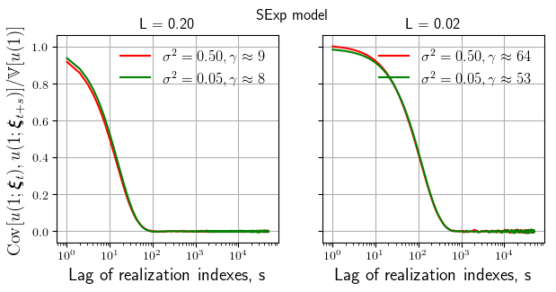


__Obervations:__

We have *.


___

#### Example #3: example03_recycler_pcgmo.py

Solves the sequence $\{u(x;\theta_t)\}_{t=1}^M$ by PCGMO for a MCMC sampled sequence $\{\kappa(x;\theta_t)\}_{t=1}^M$. Every system is solved by PCG with a constant and with realization-dependent bJ preconditioners with 5 blocks denoted by med-bJ5 and `dt`-bJ5, respectively. The constant preconditioner is built on the basis of the median operator; the realization-dependent preconditioners are redefined periodically every `dt`={`50`, `100`, `250`, `500`, `1000`} distinct realizations (i.e. discarding realizations corresponding to rejected proposals) on the basis of the current operator in the sequence.

```python
import sys; sys.path += ["../"]
from samplers import sampler
from solvers import solver
from recyclers import recycler
import numpy as np
from example03_recycler_plot import *

nEl = 1000
nsmp = 1999
sig2, L = .357, 0.05
model = "Exp"

mcmc = sampler(nEl=nEl, smp_type="mcmc", model=model, sig2=sig2, L=L)
mcmc.compute_KL()

mcmc.draw_realization()
mcmc.do_assembly()

nb = 5
dt = [50, 100, 250, 500, 1000]
pcg_dtbJ = []
pcgmo_dtbJ = []

for i, dt_i in enumerate(dt):
  pcg_dtbJ += [solver(n=mcmc.n, solver_type="pcg")]
  pcg_dtbJ[i].set_precond(Mat=mcmc.A, precond_id=3, nb=nb)

pcg_medbJ  = solver(n=mcmc.n, solver_type="pcg")
pcg_medbJ.set_precond(Mat=mcmc.get_median_A(), precond_id=3, nb=nb)

for i, dt_i in enumerate(dt):
  pcgmo_dtbJ += [recycler(sampler=mcmc, solver=pcg_dtbJ[i], recycler_type="pcgmo", dt=dt_i)]
pcgmo_medbJ = recycler(sampler=mcmc, solver=pcg_medbJ, recycler_type="pcgmo")

pcgmo_dtbJ_it, pcgmo_medbJ_it = [[] for i in range(len(dt))], []
while (mcmc.cnt_accepted_proposals <= nsmp):
  mcmc.draw_realization()
  if (mcmc.proposal_accepted):
    for i, dt_i in enumerate(dt):
      pcgmo_dtbJ[i].do_assembly()
      pcgmo_dtbJ[i].prepare()
      pcgmo_dtbJ[i].solve()
    
    pcgmo_medbJ.do_assembly()
    pcgmo_medbJ.prepare()
    pcgmo_medbJ.solve()

    for i, dt_i in enumerate(dt):
      pcgmo_dtbJ_it[i] += [pcg_dtbJ[i].it]
    pcgmo_medbJ_it += [pcg_medbJ.it]

save_data(pcgmo_medbJ_it, pcgmo_dtbJ_it)
plot()
```


__Results:__


__Observations:__

*.

___

#### Series of examples #4: example04_recycler_dcgmo.py

Solves the same sequence $\{u(x;\theta_t)\}_{t=1}^M$ by DCGMO for sequences $\{\kappa(x;\theta_t)\}_{t=1}^M$ sampled by MC and by MCMC. The effects of `kl_strategy` and `which_op` are investigated on the number of solver iterations.

Solves the same sequence $\{u(x;\theta_t)\}_{t=1}^M$ by DCGMO as in Example #4. Additionally, envelopes of strictly positive spectra, relative conditioning number of deflated operators and full spectra of the sampled operators and corresponding deflated operators are investigated.

```python
import sys; sys.path += ["../"]
from samplers import sampler
from solvers import solver
from recyclers import recycler
import numpy as np
from example04_recycler_dcgmo_plot import *
from example04_recycler_dcgmo_cases import get_params
import scipy.sparse as sparse
import scipy.sparse.linalg

nEl = 1000
# nsmp      in {200, 10000, 15000}
# (sig2, L) in {0.05, 0.50}x{0.02, 0.10, 0.50}
# model     in {"Exp", "SExp"}
# kl        in {20, 50}

case = "e7"
sig2, L, model, kl, kl_strategy, ell_min, nsmp, t_end_def, t_end_kl, t_switch_to_mc, ini_W, eigres_thresh = get_params(case)
case = "example04_"+case

smp, dcg, dcgmo = {}, {}, {}

for _smp in ("mc", "mcmc"):
  __smp = sampler(nEl=nEl, smp_type=_smp, model=model, sig2=sig2, L=L, t_switch_to_mc=t_switch_to_mc)
  __smp.compute_KL()
  __smp.draw_realization()
  __smp.do_assembly()
  smp[_smp] = __smp

cg = solver(n=smp["mc"].n, solver_type="cg")

for __smp in ("mc", "mcmc"):
  for which_op in ("previous", "current"):
    __dcg = solver(n=smp["mc"].n, solver_type="dcg")
    dcg[(__smp, which_op)] = __dcg
    dcgmo[(__smp, which_op)] = recycler(smp[__smp], __dcg, "dcgmo", kl=kl, kl_strategy=kl_strategy, ell_min=ell_min,
                                        t_end_def=t_end_def, t_end_kl=t_end_kl, ini_W=ini_W, which_op=which_op,
                                        eigres_thresh=eigres_thresh)

cgmo_it = {"mc":[], "mcmc":[]}
dcgmo_it, dcgmo_kdim, dcgmo_ell = {}, {}, {}
dcgmo_ritz_quotient, dcgmo_eigres = {}, {}
smp_SpA, dcgmo_SpHtA = {"mc":[], "mcmc":[]}, {}

# Possibly not needed:
dcgmo_sin_theta = {}
dcgmo_approx_eigvals = {}
#dcgmo_ave_gap_bound = {}


for i_smp in range(nsmp):
  smp["mc"].draw_realization()
  smp_SpA["mc"] += [np.linalg.eigvalsh(smp["mc"].A.A)]
  cg.presolve(smp["mc"].A, smp["mc"].b)
  cg.solve(x0=np.zeros(smp["mc"].n))
  cgmo_it["mc"] += [cg.it]

  _, U = sparse.linalg.eigsh(smp["mc"].A.tocsc(), k=kl, sigma=0, mode='normal')

  for which_op in ("previous", "current"):
    _dcgmo = ("mc", which_op)

    if not (dcgmo_SpHtA.has_key(_dcgmo)):
      dcgmo_SpHtA[_dcgmo] = []
      dcgmo_kdim[_dcgmo], dcgmo_ell[_dcgmo], dcgmo_approx_eigvals[_dcgmo] = [], [], []
      dcgmo_ritz_quotient[_dcgmo], dcgmo_eigres[_dcgmo] = [], []
      ##dcgmo_ave_gap_bound[_dcgmo] = []
      dcgmo_it[_dcgmo] = []
      dcgmo_sin_theta[_dcgmo] = []

    dcgmo[_dcgmo].do_assembly()
    dcgmo[_dcgmo].prepare()

    if (dcgmo[_dcgmo].solver.kdim > 0):
      QW,_ = np.linalg.qr(dcgmo[_dcgmo].solver.W, mode='reduced')
      C = QW.T.dot(U[:,:dcgmo[_dcgmo].solver.kdim])
      cos_theta = np.linalg.svd(C, compute_uv=False)
      sin_theta = np.sqrt(1.-cos_theta**2)
      dcgmo_sin_theta[_dcgmo] += [sin_theta]
    else:
      dcgmo_sin_theta[_dcgmo] += [None]


    print dcgmo[_dcgmo].solver.kdim
    dcgmo_kdim[_dcgmo] += [dcgmo[_dcgmo].solver.kdim]
    dcgmo_ell[_dcgmo] += [dcgmo[_dcgmo].solver.ell]

    if (dcgmo_kdim[_dcgmo][-1] > 0):
      HtA = dcgmo[_dcgmo].solver.get_deflated_op()
      dcgmo_SpHtA[_dcgmo] += [np.linalg.eigvalsh(HtA.A)]
      dcgmo_approx_eigvals[_dcgmo] += [np.copy(dcgmo[_dcgmo].eigvals)]
      dcgmo_ritz_quotient[_dcgmo] += [np.copy(dcgmo[_dcgmo].ritz_quotient)]
      dcgmo_eigres[_dcgmo] += [np.copy(dcgmo[_dcgmo].eigres)]
      #dcgmo_ave_gap_bound[_dcgmo] += [np.copy(dcgmo[_dcgmo].ave_gap_bound)]

    else:
      dcgmo_SpHtA[_dcgmo] += [np.array(smp["mc"].n*[None])]
      dcgmo_approx_eigvals[_dcgmo] += [None]
      dcgmo_ritz_quotient[_dcgmo] += [None]
      dcgmo_eigres[_dcgmo] += [None]
      #dcgmo_ave_gap_bound[_dcgmo] += [None]

    dcgmo[_dcgmo].solve()
    dcgmo_it[_dcgmo] += [dcgmo[_dcgmo].solver.it]

  print("%d/%d" %(i_smp+1, nsmp))


while (smp["mcmc"].cnt_accepted_proposals <= nsmp):
  smp["mcmc"].draw_realization()
  if (smp["mcmc"].proposal_accepted):
    smp_SpA["mcmc"] += [np.linalg.eigvalsh(smp["mc"].A.A)]
    cg.presolve(smp["mcmc"].A, smp["mcmc"].b)
    cg.solve(x0=np.zeros(smp["mcmc"].n))
    cgmo_it["mcmc"] += [cg.it]

    _, U = sparse.linalg.eigsh(smp["mc"].A.tocsc(), k=kl, sigma=0, mode='normal')

    for which_op in ("previous", "current"):
      _dcgmo = ("mcmc", which_op)

      if not (dcgmo_SpHtA.has_key(_dcgmo)):
        dcgmo_SpHtA[_dcgmo] = []
        dcgmo_kdim[_dcgmo], dcgmo_ell[_dcgmo], dcgmo_approx_eigvals[_dcgmo] = [], [], []
        dcgmo_ritz_quotient[_dcgmo], dcgmo_eigres[_dcgmo] = [], []
        #dcgmo_ave_gap_bound[_dcgmo] = []
        dcgmo_it[_dcgmo] = []
        dcgmo_sin_theta[_dcgmo] = []

      dcgmo[_dcgmo].do_assembly()
      dcgmo[_dcgmo].prepare()

      if (dcgmo[_dcgmo].solver.kdim > 0):
        QW,_ = np.linalg.qr(dcgmo[_dcgmo].solver.W, mode='reduced')
        C = QW.T.dot(U[:,:dcgmo[_dcgmo].solver.kdim])
        cos_theta = np.linalg.svd(C, compute_uv=False)
        sin_theta = np.sqrt(1.-cos_theta**2)
        dcgmo_sin_theta[_dcgmo] += [sin_theta]
      else:
        dcgmo_sin_theta[_dcgmo] += [None]

      print dcgmo[_dcgmo].solver.kdim
      dcgmo_kdim[_dcgmo] += [dcgmo[_dcgmo].solver.kdim]
      dcgmo_ell[_dcgmo] += [dcgmo[_dcgmo].solver.ell]

      dcgmo[_dcgmo].solve()
      dcgmo_it[_dcgmo] += [dcgmo[_dcgmo].solver.it]

      if (dcgmo_kdim[_dcgmo][-1] > 0):
        HtA = dcgmo[_dcgmo].solver.get_deflated_op()
        dcgmo_SpHtA[_dcgmo] += [np.linalg.eigvalsh(HtA.A)]
        dcgmo_approx_eigvals[_dcgmo] += [np.copy(dcgmo[_dcgmo].eigvals)]
        dcgmo_ritz_quotient[_dcgmo] += [np.copy(dcgmo[_dcgmo].ritz_quotient)]
        dcgmo_eigres[_dcgmo] += [np.copy(dcgmo[_dcgmo].eigres)]
        #dcgmo_ave_gap_bound[_dcgmo] += [np.copy(dcgmo[_dcgmo].ave_gap_bound)]
      else:
        dcgmo_SpHtA[_dcgmo] += [np.array(smp["mcmc"].n*[None])]
        dcgmo_approx_eigvals[_dcgmo] += [None]
        dcgmo_ritz_quotient[_dcgmo] += [None]
        dcgmo_eigres[_dcgmo] += [None]
        #dcgmo_ave_gap_bound[_dcgmo] += [None]

    print("%d/%d" %(smp["mcmc"].cnt_accepted_proposals+1, nsmp))

save_data(smp, cgmo_it, dcgmo_it, smp_SpA, dcgmo_SpHtA, dcgmo_ell, dcgmo_kdim, dcgmo_approx_eigvals, dcgmo_ritz_quotient, dcgmo_eigres, dcgmo_sin_theta, case)
plot(_smp="mc", case_id=case)
plot(_smp="mcmc", case_id=case)
```


__List of examples:__

| case_id   | parameters                                                   |
| --------- | ------------------------------------------------------------ |
| `"04_a"`  | `sig2`=`0.05`; `L`=`0.02`; `model`=`"Exp"`; `kl`=`20`; `kl_strategy`=`0`; `ell_min`=`kl/2`; `nsmp`=`10000`; `t_end_def`=`0`; `t_end_kl`=`0`; `t_switch_to_mc`=`0`; `ini_W`=`False` |
| `"04_b"`  | `sig2`=`0.05`; `L`=`0.02`; `model`=`"Exp"`; `kl`=`20`; `kl_strategy`=`0`; `ell_min`=`3*kl/4`; `nsmp`=`10000`;`t_end_def`=`0`; `t_end_kl`=`0`; `t_switch_to_mc`=`0`; `ini_W`=`False` |
| `"04_c"`  | `sig2`=`0.05`; `L`=`0.02`; `model`=`"Exp"`; `kl`=`20`; `kl_strategy`=`0`; `ell_min`=`kl/4`; `nsmp`=`10000`;`t_end_def`=`0`; `t_end_kl`=`0`; `t_switch_to_mc`=`0`; `ini_W`=`False` |
| `"04_d"`  | `sig2`=`0.05`; `L`=`0.02`; `model`=`"Exp"`; `kl`=`20`; `kl_strategy`=`1`; `ell_min`=`kl/2`; `nsmp`=`10000`;`t_end_def`=`0`; `t_end_kl`=`5000`; `t_switch_to_mc`=`0`; `ini_W`=`False` |
| `"04_e"`  | `sig2`=`0.05`; `L`=`0.02`; `model`=`"Exp"`; `kl`=`20`; `kl_strategy`=`1`; `ell_min`=`kl/4`; `nsmp`=`10000`;`t_end_def`=`0`; `t_end_kl`=`5000`; `t_switch_to_mc`=`0`; `ini_W`=`False` |
| `"04_f"`  | `sig2`=`0.05`; `L`=`0.02`; `model`=`"Exp"`; `kl`=`20`; `kl_strategy`=`1`; `ell_min`=`3*kl/4`; `nsmp`=`10000`;`t_end_def`=`0`; `t_end_kl`=`5000`; `t_switch_to_mc`=`0`; `ini_W`=`False` |
| `"04_e5"` | `sig2`=`0.05`; `L`=`0.02`; `model`=`"Exp"`; `kl`=`20`; `kl_strategy`=`1`; `ell_min`=`kl/4`; `nsmp`=`15000`;`t_end_def`=`0`; `t_end_kl`=`5000`; `t_switch_to_mc`=`7000`; `ini_W`=`False` |
| `"04_e7"` | `sig2`=`0.05`; `L`=`0.02`; `model`=`"Exp"`; `kl`=`20`; `kl_strategy`=`1`; `ell_min`=`kl/4`; `nsmp`=`15000`;`t_end_def`=`0`; `t_end_kl`=`1000`; `t_switch_to_mc`=`7000`; `ini_W`=`False` |
| `"04_a3"` | `sig2`=`0.05`; `L`=`0.02`; `model`=`"Exp"`; `kl`=`20`; `kl_strategy`=`0`; `ell_min`=`kl/2`; `nsmp`=`10000`;`t_end_def`=`nsmp`; `t_end_kl`=`0`; `t_switch_to_mc`=`7000`; `ini_W`=`True` |
| `"04_a2"` | `sig2`=`0.50`; `L`=`0.02`; `model`=`"Exp"`; `kl`=`20`; `kl_strategy`=`0`; `ell_min`=`kl/2`; `nsmp`=`15000`;`t_end_def`=`0`; `t_end_kl`=`0`; `t_switch_to_mc`=`0`; `ini_W`=`False` |
| `"04_e6"` | `sig2`=`0.50`; `L`=`0.02`; `model`=`"Exp"`; `kl`=`20`; `kl_strategy`=`1`; `ell_min`=`kl/4`; `nsmp`=`10000`;`t_end_def`=`0`; `t_end_kl`=`5000`; `t_switch_to_mc`=`7000`; `ini_W`=`False` |
| `"04_a4"` | `sig2`=`0.50`; `L`=`0.02`; `model`=`"Exp"`; `kl`=`20`; `kl_strategy`=`0`; `ell_min`=`kl/2`; `nsmp`=`10000`;`t_end_def`=`nsmp`; `t_end_kl`=`5000`; `t_switch_to_mc`=`7000`; `ini_W`=`True` |
| `"04_a5"` | `sig2`=`0.50`; `L`=`0.02`; `model`=`"Exp"`; `kl`=`20`; `kl_strategy`=`0`; `ell_min`=`kl/2`; `nsmp`=`200`;`t_end_def`=`0`; `t_end_kl`=`5000`; `t_switch_to_mc`=`0`; `ini_W`=`True` |


__Results:__

_Example04_a_ (`sig2`=`0.05`; `L`=`0.02`; `model`=`"Exp"`; `kl`=`20`; `kl_strategy`=`0`; `ell_min`=`kl/2`; `nsmp`=`10000`; `t_end_def`=`0`; `t_end_kl`=`0`; `t_switch_to_mc`=`0`; `ini_W`=`False`) :


_Example04_b_ (`sig2`=`0.05`; `L`=`0.02`; `model`=`"Exp"`; `kl`=`20`; `kl_strategy`=`0`; `ell_min`=`3*kl/4`; `nsmp`=`10000`;`t_end_def`=`0`; `t_end_kl`=`0`; `t_switch_to_mc`=`0`; `ini_W`=`False`) :


_Example04_c_ (`sig2`=`0.05`; `L`=`0.02`; `model`=`"Exp"`; `kl`=`20`; `kl_strategy`=`0`; `ell_min`=`kl/4`; `nsmp`=`10000`;`t_end_def`=`0`; `t_end_kl`=`0`; `t_switch_to_mc`=`0`; `ini_W`=`False`) :


_Example04_d_ (`sig2`=`0.05`; `L`=`0.02`; `model`=`"Exp"`; `kl`=`20`; `kl_strategy`=`1`; `ell_min`=`kl/2`; `nsmp`=`10000`;`t_end_def`=`0`; `t_end_kl`=`5000`; `t_switch_to_mc`=`0`; `ini_W`=`False`) :


_Example04_e_ (`sig2`=`0.05`; `L`=`0.02`; `model`=`"Exp"`; `kl`=`20`; `kl_strategy`=`1`; `ell_min`=`kl/4`; `nsmp`=`10000`;`t_end_def`=`0`; `t_end_kl`=`5000`; `t_switch_to_mc`=`0`; `ini_W`=`False`) :


_Example04_f_ (`sig2`=`0.05`; `L`=`0.02`; `model`=`"Exp"`; `kl`=`20`; `kl_strategy`=`1`; `ell_min`=`3*kl/4`; `nsmp`=`10000`;`t_end_def`=`0`; `t_end_kl`=`5000`; `t_switch_to_mc`=`0`; `ini_W`=`False`) :


_Example04_e5_ (`sig2`=`0.05`; `L`=`0.02`; `model`=`"Exp"`; `kl`=`20`; `kl_strategy`=`1`; `ell_min`=`kl/4`; `nsmp`=`15000`;`t_end_def`=`0`; `t_end_kl`=`5000`; `t_switch_to_mc`=`7000`; `ini_W`=`False`) :


_Example04_e7_ (`sig2`=`0.05`; `L`=`0.02`; `model`=`"Exp"`; `kl`=`20`; `kl_strategy`=`1`; `ell_min`=`kl/4`; `nsmp`=`15000`;`t_end_def`=`0`; `t_end_kl`=`1000`; `t_switch_to_mc`=`7000`; `ini_W`=`False`) :


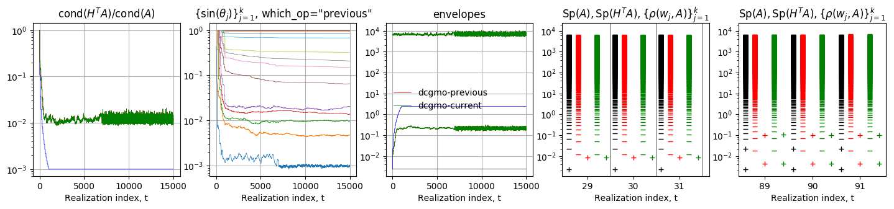


_Example04_a3_ (`sig2`=`0.05`; `L`=`0.02`; `model`=`"Exp"`; `kl`=`20`; `kl_strategy`=`0`; `ell_min`=`kl/2`; `nsmp`=`10000`;`t_end_def`=`nsmp`; `t_end_kl`=`0`; `t_switch_to_mc`=`7000`; `ini_W`=`True`) :

Starting deflation subspace spanned by eigenvectors of $\hat{\mathbf{A}}$.


_Example04_a2_ (`sig2`=`0.50`; `L`=`0.02`; `model`=`"Exp"`; `kl`=`20`; `kl_strategy`=`0`; `ell_min`=`kl/2`; `nsmp`=`15000`;`t_end_def`=`0`; `t_end_kl`=`0`; `t_switch_to_mc`=`0`; `ini_W`=`False`) :


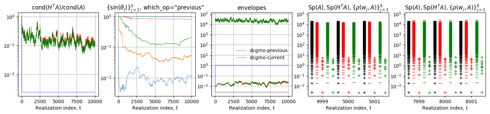


_Example04_e6_ (`sig2`=`0.50`; `L`=`0.02`; `model`=`"Exp"`; `kl`=`20`; `kl_strategy`=`1`; `ell_min`=`kl/4`; `nsmp`=`10000`;`t_end_def`=`0`; `t_end_kl`=`5000`; `t_switch_to_mc`=`7000`; `ini_W`=`False`) :

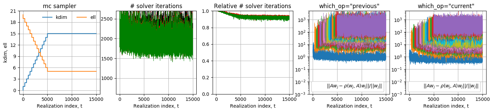


_Example04_a4_ (`sig2`=`0.50`; `L`=`0.02`; `model`=`"Exp"`; `kl`=`20`; `kl_strategy`=`0`; `ell_min`=`kl/2`; `nsmp`=`10000`;`t_end_def`=`nsmp`; `t_end_kl`=`5000`; `t_switch_to_mc`=`7000`; `ini_W`=`True`) :

Starting deflation subspace spanned by eigenvectors of $\hat{\mathbf{A}}$:


_Example04_a5_ (`sig2`=`0.50`; `L`=`0.02`; `model`=`"Exp"`; `kl`=`20`; `kl_strategy`=`0`; `ell_min`=`kl/2`; `nsmp`=`200`;`t_end_def`=`0`; `t_end_kl`=`5000`; `t_switch_to_mc`=`0`; `ini_W`=`True`) :

Deflation subspace is and remains (i.e. no update) spanned by eigenvectors of $\hat{\mathbf{A}}$.


__Observations:__

First, strategy is important for MCMC, not really for MC. Second, which_op has an effect with MC. Third, for MCMC, no strong effect of `which_op`. This suggests *. This makes sense from a backward error perspective.

First, the strictly positive envelopes, and conditioning number, of the sampled spectra deflated with exact eigenvectors do not significantly vary from realization to realization. Second, the cases for which higher gains of iterations were observed in Example #4, namely strategies #2 and #3, are associated with smaller relative conditioning numbers of deflated operators, here by about half an order of magnitude for MCMC sampling in comparison to strategy #1, and less in case of MC sampling. Third, absence of significant effect of `which_op` observed in Example #4 is similarly observed on the deflated spectra, particularly so in case of MCMC sampling. 


___

#### Series of example #5: example05_recycler_dpcgmo.py

Solves the sequence $\{u(x;\theta_t)\}_{t=1}^M$ by DPCGMO for sequences $\{\kappa(x;\theta_t)\}_{t=1}^M$ sampled by MC and by MCMC. In both cases, three different constant preconditioners are used : (1) median-bJ10, (2) median and (3) median-AMG. The effect of `dp_seq` and `which_op` are investigated on the number of solver iterations in comparison to those obtained by PCG resolution.

```python
import sys; sys.path += ["../"]
from samplers import sampler
from solvers import solver
from recyclers import recycler
import numpy as np
import scipy
from example05_recycler_dpcgmo_plot import *
from example05_recycler_dpcgmo_cases import get_params
import scipy.sparse as sparse

nEl = 1000
# nsmp       in {200, 10000, 15000}
# (sig2, L)  in {0.05, 0.50}x{0.02, 0.10, 0.50}
# model      in {"Exp", "SExp"}
# kl         in {20, 50}
# nsmp       in {200}
# precond_id in {1, 2, 3}

case = "b2" # {"a", "b", "c"}
precond_id, sig2, L, model, kl, kl_strategy, ell_min, nsmp, t_end_def, t_end_kl, t_switch_to_mc, ini_W, eigres_thresh = get_params(case)
case = "example05_"+case

smp, dpcg, dpcgmo = {}, {}, {}

for _smp in ("mc", "mcmc"):
  __smp = sampler(nEl=nEl, smp_type=_smp, model=model, sig2=sig2, L=L)
  __smp.compute_KL()
  __smp.draw_realization()
  __smp.do_assembly()
  smp[_smp] = __smp

pcg = solver(n=smp["mc"].n, solver_type="pcg")
if (precond_id == 3):
  pcg.set_precond(Mat=smp["mc"].get_median_A(), precond_id=3, nb=10)
elif (precond_id == 1):
  pcg.set_precond(Mat=smp["mc"].get_median_A(), precond_id=1)
elif (precond_id == 2):
  pcg.set_precond(Mat=smp["mc"].get_median_A(), precond_id=2)

pcg.get_chol_M()
L = pcg.L_M
inv_L = pcg.invL_M

for __smp in ("mc", "mcmc"):
  for dp_seq in ("dp", "pd"):
    for which_op in ("previous", "current"):
      __dpcg = solver(n=smp["mc"].n, solver_type="dpcg")
      if (precond_id == 3):
        __dpcg.set_precond(Mat=smp["mc"].get_median_A(), precond_id=3, nb=10)
      elif (precond_id == 1):
        __dpcg.set_precond(Mat=smp["mc"].get_median_A(), precond_id=1)
      elif (precond_id ==2):
        __dpcg.set_precond(Mat=smp["mc"].get_median_A(), precond_id=2)
      __dpcg.get_chol_M()
      dpcg[(__smp, dp_seq, which_op)] = __dpcg
      dpcgmo[(__smp, dp_seq, which_op)] = recycler(smp[__smp], __dpcg, "dpcgmo", kl=kl, kl_strategy=kl_strategy, 
                                                   ell_min=ell_min, dp_seq=dp_seq, t_end_def=t_end_def, t_end_kl=t_end_kl, 
                                                   ini_W=ini_W, which_op=which_op, eigres_thresh=eigres_thresh)

pcgmo_it = {"mc":[], "mcmc":[]}
dpcgmo_it = {}

dpcgmo_it, dpcgmo_kdim, dpcgmo_ell = {}, {}, {}
dpcgmo_ritz_quotient, dpcgmo_eigres = {}, {}
smp_SpdA, dpcgmo_SpdHtdA = {"mc":[], "mcmc":[]}, {}
smp_SpA, dpcgmo_SpHtA = {"mc":[], "mcmc":[]}, {}
dpcgmo_SpdHtdA2 = {}

# Possibly not needed:
dpcgmo_sin_theta = {}
dpcgmo_approx_eigvals = {}

for i_smp in range(nsmp):
  smp["mc"].draw_realization()  

  smp_SpdA["mc"] += [np.linalg.eigvalsh((inv_L.dot(smp["mc"].A.dot(inv_L.T))).A)]
  smp_SpA["mc"] += [np.linalg.eigvalsh(smp["mc"].A.A)]

  pcg.presolve(smp["mc"].A, smp["mc"].b)
  pcg.solve(x0=np.zeros(smp["mc"].n))
  pcgmo_it["mc"] += [pcg.it]  

  _, U = sparse.linalg.eigsh(smp["mc"].A.tocsc(), k=kl, sigma=0, mode='normal')
  _, dU = sparse.linalg.eigsh(inv_L.T.dot(smp["mc"].A.dot(inv_L.T)).tocsc(), k=kl, sigma=0, mode='normal')

  for dp_seq in ("dp", "pd"):
    for which_op in ("previous", "current"):
      _dpcgmo = ("mc", dp_seq, which_op)

      if not (dpcgmo_SpdHtdA.has_key(_dpcgmo)):
        dpcgmo_SpdHtdA[_dpcgmo] = []
        dpcgmo_SpHtA[_dpcgmo] = []
        if (dp_seq == "pd"):
          dpcgmo_SpdHtdA2[_dpcgmo] = []
        dpcgmo_kdim[_dpcgmo], dpcgmo_ell[_dpcgmo], dpcgmo_approx_eigvals[_dpcgmo] = [], [], []
        dpcgmo_ritz_quotient[_dpcgmo], dpcgmo_eigres[_dpcgmo] = [], []
        dpcgmo_it[_dpcgmo] = []
        dpcgmo_sin_theta[_dpcgmo] = []  

      dpcgmo[_dpcgmo].do_assembly()
      dpcgmo[_dpcgmo].prepare()

      if (dpcgmo[_dpcgmo].solver.kdim > 0):
        if (dp_seq == "pd"):
          QW,_ = np.linalg.qr(dpcgmo[_dpcgmo].solver.W, mode='reduced')
          C = QW.T.dot(U[:,:dpcgmo[_dpcgmo].solver.kdim])
        elif (dp_seq == "dp"):
          QW,_ = np.linalg.qr(L.T.dot(dpcgmo[_dpcgmo].solver.W), mode='reduced')
          C = QW.T.dot(dU[:,:dpcgmo[_dpcgmo].solver.kdim])
        cos_theta = np.linalg.svd(C, compute_uv=False)
        sin_theta = np.sqrt(1.-cos_theta**2)
        dpcgmo_sin_theta[_dpcgmo] += [sin_theta]
      else:
        dpcgmo_sin_theta[_dpcgmo] += [None]

      print dpcgmo[_dpcgmo].solver.kdim
      dpcgmo_kdim[_dpcgmo] += [dpcgmo[_dpcgmo].solver.kdim]
      dpcgmo_ell[_dpcgmo] += [dpcgmo[_dpcgmo].solver.ell]  

      if (dpcgmo_kdim[_dpcgmo][-1] > 0):
        HtA = dpcgmo[_dpcgmo].solver.get_deflated_op()
        dHtdA = inv_L.A.dot(HtA.dot(inv_L.A.T))
        dpcgmo_SpdHtdA[_dpcgmo] += [np.linalg.eigvalsh(dHtdA.A)]
        dpcgmo_SpHtA[_dpcgmo] += [np.linalg.eigvalsh(HtA.A)]

        if (dp_seq == "pd"):
          AU = smp["mc"].A.dot(U[:,:dpcgmo[_dpcgmo].solver.kdim])
          UtAU = U[:,:dpcgmo[_dpcgmo].solver.kdim].T.dot(AU)
          HtA2 = smp["mc"].A-AU.dot(scipy.linalg.inv(UtAU).dot(AU.T))
          dHtdA2 = inv_L.A.dot(HtA2.dot(inv_L.A.T))
          dpcgmo_SpdHtdA2[_dpcgmo] += [np.linalg.eigvalsh(dHtdA2)]  

        dpcgmo_approx_eigvals[_dpcgmo] += [np.copy(dpcgmo[_dpcgmo].eigvals)]
        dpcgmo_ritz_quotient[_dpcgmo] += [np.copy(dpcgmo[_dpcgmo].ritz_quotient)]
        dpcgmo_eigres[_dpcgmo] += [np.copy(dpcgmo[_dpcgmo].eigres)]
      else:
        dpcgmo_SpdHtdA[_dpcgmo] += [np.array(smp["mc"].n*[None])]
        dpcgmo_SpHtA[_dpcgmo] += [np.array(smp["mc"].n*[None])]
        if (dp_seq == "pd"):
          dpcgmo_SpdHtdA2[_dpcgmo] += [np.array(smp["mc"].n*[None])]
        dpcgmo_approx_eigvals[_dpcgmo] += [None]
        dpcgmo_ritz_quotient[_dpcgmo] += [None]
        dpcgmo_eigres[_dpcgmo] += [None]  

      dpcgmo[_dpcgmo].solve()
      dpcgmo_it[_dpcgmo] += [dpcgmo[_dpcgmo].solver.it]  

    print("%d/%d" %(i_smp+1, nsmp))


while (smp["mcmc"].cnt_accepted_proposals <= nsmp):
  smp["mcmc"].draw_realization()

  if (smp["mcmc"].proposal_accepted):
    smp_SpdA["mcmc"] += [np.linalg.eigvalsh((inv_L.dot(smp["mc"].A.dot(inv_L.T))).A)]
    smp_SpA["mcmc"] += [np.linalg.eigvalsh(smp["mc"].A.A)]
    
    pcg.presolve(smp["mcmc"].A, smp["mcmc"].b)
    pcg.solve(x0=np.zeros(smp["mcmc"].n))
    pcgmo_it["mcmc"] += [pcg.it]

    _, U = sparse.linalg.eigsh(smp["mc"].A.tocsc(), k=kl, sigma=0, mode='normal')
    _, dU = sparse.linalg.eigsh(inv_L.T.dot(smp["mc"].A.dot(inv_L.T)).tocsc(), k=kl, sigma=0, mode='normal')

    for dp_seq in ("dp", "pd"):
      for which_op in ("previous", "current"):
        _dpcgmo = ("mcmc", dp_seq, which_op)

        if not (dpcgmo_SpdHtdA.has_key(_dpcgmo)):
          dpcgmo_SpdHtdA[_dpcgmo] = []
          dpcgmo_SpHtA[_dpcgmo] = []
          if (dp_seq == "pd"):
            dpcgmo_SpdHtdA2[_dpcgmo] = []
          dpcgmo_kdim[_dpcgmo], dpcgmo_ell[_dpcgmo], dpcgmo_approx_eigvals[_dpcgmo] = [], [], []
          dpcgmo_ritz_quotient[_dpcgmo], dpcgmo_eigres[_dpcgmo] = [], []
          dpcgmo_it[_dpcgmo] = []
          dpcgmo_sin_theta[_dpcgmo] = []  

        dpcgmo[_dpcgmo].do_assembly()
        dpcgmo[_dpcgmo].prepare()

        if (dpcgmo[_dpcgmo].solver.kdim > 0):
          if (dp_seq == "pd"):
            QW,_ = np.linalg.qr(dpcgmo[_dpcgmo].solver.W, mode='reduced')
            C = QW.T.dot(U[:,:dpcgmo[_dpcgmo].solver.kdim])
          elif (dp_seq == "dp"):
            QW,_ = np.linalg.qr(L.T.dot(dpcgmo[_dpcgmo].solver.W), mode='reduced')
            C = QW.T.dot(dU[:,:dpcgmo[_dpcgmo].solver.kdim])
          cos_theta = np.linalg.svd(C, compute_uv=False)
          sin_theta = np.sqrt(1.-cos_theta**2)
          dpcgmo_sin_theta[_dpcgmo] += [sin_theta]
        else:
          dpcgmo_sin_theta[_dpcgmo] += [None]

        print dpcgmo[_dpcgmo].solver.kdim
        dpcgmo_kdim[_dpcgmo] += [dpcgmo[_dpcgmo].solver.kdim]
        dpcgmo_ell[_dpcgmo] += [dpcgmo[_dpcgmo].solver.ell]  

        if (dpcgmo_kdim[_dpcgmo][-1] > 0):
          HtA = dpcgmo[_dpcgmo].solver.get_deflated_op()
          dHtdA = inv_L.A.dot(HtA.dot(inv_L.A.T))
          dpcgmo_SpdHtdA[_dpcgmo] += [np.linalg.eigvalsh(dHtdA.A)]
          dpcgmo_SpHtA[_dpcgmo] += [np.linalg.eigvalsh(HtA.A)]

          if (dp_seq == "pd"):
            AU = smp["mc"].A.dot(U[:,:dpcgmo[_dpcgmo].solver.kdim])
            UtAU = U[:,:dpcgmo[_dpcgmo].solver.kdim].T.dot(AU)
            HtA2 = smp["mc"].A-AU.dot(scipy.linalg.inv(UtAU).dot(AU.T))
            dHtdA2 = inv_L.A.dot(HtA2.dot(inv_L.A.T))
            dpcgmo_SpdHtdA2[_dpcgmo] += [np.linalg.eigvalsh(dHtdA2)]  

          dpcgmo_approx_eigvals[_dpcgmo] += [np.copy(dpcgmo[_dpcgmo].eigvals)]
          dpcgmo_ritz_quotient[_dpcgmo] += [np.copy(dpcgmo[_dpcgmo].ritz_quotient)]
          dpcgmo_eigres[_dpcgmo] += [np.copy(dpcgmo[_dpcgmo].eigres)]
        else:
          dpcgmo_SpdHtdA[_dpcgmo] += [np.array(smp["mc"].n*[None])]
          dpcgmo_SpHtA[_dpcgmo] += [np.array(smp["mc"].n*[None])]          
          if (dp_seq == "pd"):
            dpcgmo_SpdHtdA2[_dpcgmo] += [np.array(smp["mc"].n*[None])]
          dpcgmo_approx_eigvals[_dpcgmo] += [None]
          dpcgmo_ritz_quotient[_dpcgmo] += [None]
          dpcgmo_eigres[_dpcgmo] += [None]  

        dpcgmo[_dpcgmo].solve()
        dpcgmo_it[_dpcgmo] += [dpcgmo[_dpcgmo].solver.it]

    print("%d/%d" %(smp["mcmc"].cnt_accepted_proposals+1, nsmp))

save_data(smp, pcgmo_it, dpcgmo_it, smp_SpdA, smp_SpA, dpcgmo_SpdHtdA, dpcgmo_SpdHtdA2, dpcgmo_SpHtA, dpcgmo_ell, dpcgmo_kdim, dpcgmo_approx_eigvals, dpcgmo_ritz_quotient, dpcgmo_eigres, dpcgmo_sin_theta, case)

plot(_smp="mc", precond_id=precond_id, case_id=case)
plot(_smp="mcmc", precond_id=precond_id, case_id=case)
```


__List of examples:__

| case_id    | parameters                                                   |
| ---------- | ------------------------------------------------------------ |
| `"05_a"`   | `sig2`=`0.05`; `L`=`0.02`; `model`=`"Exp"`; `kl`=`20`; `kl_strategy`=`0`; `ell_min`=`kl/2`; `nsmp`=`200`; `t_end_def`=`0`; `t_end_kl`=`0`; `t_switch_to_mc`=`0`; `ini_W`=`False`, `precond_id`=`3` |
| `"05_a2"`  | `sig2`=`0.05`; `L`=`0.02`; `model`=`"Exp"`; `kl`=`20`; `kl_strategy`=`0`; `ell_min`=`kl/2`; `nsmp`=`200`; `t_end_def`=`0`; `t_end_kl`=`0`; `t_switch_to_mc`=`0`; `ini_W`=`True`, `precond_id`=`3` |
| `"05_b"`   | `sig2`=`0.05`; `L`=`0.02`; `model`=`"Exp"`; `kl`=`20`; `kl_strategy`=`0`; `ell_min`=`kl/2`; `nsmp`=`200`; `t_end_def`=`0`; `t_end_kl`=`0`; `t_switch_to_mc`=`0`; `ini_W`=`False`, `precond_id`=`1` |
| `"05_b2"`  | `sig2`=`0.05`; `L`=`0.02`; `model`=`"Exp"`; `kl`=`20`; `kl_strategy`=`1`; `ell_min`=`kl/2`; `nsmp`=`2000`; `t_end_def`=`0`; `t_end_kl`=`500`; `t_switch_to_mc`=`1000`; `ini_W`=`False`, `precond_id`=`1` |
| `"05_c"`   | `sig2`=`0.05`; `L`=`0.02`; `model`=`"Exp"`; `kl`=`20`; `kl_strategy`=`0`; `ell_min`=`kl/2`; `nsmp`=`200`; `t_end_def`=`0`; `t_end_kl`=`0`; `t_switch_to_mc`=`0`; `ini_W`=`False`, `precond_id`=`2` |
| `"05_c2"`  | `sig2`=`0.05`; `L`=`0.02`; `model`=`"Exp"`; `kl`=`20`; `kl_strategy`=`1`; `ell_min`=`kl/4`; `nsmp`=`2000`; `t_end_def`=`0`; `t_end_kl`=`1000`; `t_switch_to_mc`=`1200`; `ini_W`=`False`, `precond_id`=`2` |
| `"05_c3"`  | `sig2`=`0.05`; `L`=`0.02`; `model`=`"Exp"`; `kl`=`20`; `kl_strategy`=`0`; `ell_min`=`kl/4`; `nsmp`=`200`; `t_end_def`=`0`; `t_end_kl`=`0`; `t_switch_to_mc`=`0`; `ini_W`=`False`, `precond_id`=`2` |
| `"05_c4"`  | `sig2`=`0.05`; `L`=`0.02`; `model`=`"Exp"`; `kl`=`20`; `kl_strategy`=`0`; `ell_min`=`3*kl/4`; `nsmp`=`200`; `t_end_def`=`0`; `t_end_kl`=`0`; `t_switch_to_mc`=`0`; `ini_W`=`False`, `precond_id`=`2` |
| `"05_c5"`  | `sig2`=`0.05`; `L`=`0.02`; `model`=`"Exp"`; `kl`=`20`; `kl_strategy`=`0`; `ell_min`=`3*kl/4`; `nsmp`=`2000`; `t_end_def`=`500`; `t_end_kl`=`0`; `t_switch_to_mc`=`500`; `ini_W`=`False`, `precond_id`=`2` |
| `"05_c5"`  | `sig2`=`0.50`; `L`=`0.02`; `model`=`"Exp"`; `kl`=`20`; `kl_strategy`=`0`; `ell_min`=`kl/2`; `nsmp`=`200`; `t_end_def`=`0`; `t_end_kl`=`0`; `t_switch_to_mc`=`0`; `ini_W`=`False`, `precond_id`=`2` |
| `"05_c6"`  | `sig2`=`0.50`; `L`=`0.02`; `model`=`"Exp"`; `kl`=`20`; `kl_strategy`=`0`; `ell_min`=`kl/2`; `nsmp`=`200`; `t_end_def`=`0`; `t_end_kl`=`0`; `t_switch_to_mc`=`0`; `ini_W`=`False`, `precond_id`=`2` |
| `"05_c7"`  | `sig2`=`0.50`; `L`=`0.02`; `model`=`"Exp"`; `kl`=`20`; `kl_strategy`=`0`; `ell_min`=`kl/4`; `nsmp`=`200`; `t_end_def`=`0`; `t_end_kl`=`0`; `t_switch_to_mc`=`0`; `ini_W`=`False`, `precond_id`=`2` |
| `"05_c8"`  | `sig2`=`0.50`; `L`=`0.02`; `model`=`"Exp"`; `kl`=`20`; `kl_strategy`=`0`; `ell_min`=`kl/4`; `nsmp`=`2000`; `t_end_def`=`0`; `t_end_kl`=`500`; `t_switch_to_mc`=`500`; `ini_W`=`False`, `precond_id`=`2` |
| `"05_c9"`  | `sig2`=`0.50`; `L`=`0.02`; `model`=`"Exp"`; `kl`=`20`; `kl_strategy`=`0`; `ell_min`=`kl/4`; `nsmp`=`2000`; `t_end_def`=`500`; `t_end_kl`=`500`; `t_switch_to_mc`=`500`; `ini_W`=`False`, `precond_id`=`2` |
| `"05_c10"` | `sig2`=`0.50`; `L`=`0.02`; `model`=`"Exp"`; `kl`=`20`; `kl_strategy`=`1`; `ell_min`=`kl/4`; `nsmp`=`2000`; `t_end_def`=`0`; `t_end_kl`=`1000`; `t_switch_to_mc`=`1200`; `ini_W`=`False`, `precond_id`=`2` |
|            |                                                              |


__Results:__

_Example05_a_ (`sig2`=`0.05`; `L`=`0.02`; `model`=`"Exp"`; `kl`=`20`; `kl_strategy`=`0`; `ell_min`=`kl/2`; `nsmp`=`200`; `t_end_def`=`0`; `t_end_kl`=`0`; `t_switch_to_mc`=`0`; `ini_W`=`False`, `precond_id`=`3`):


_Example05_a2_ (`sig2`=`0.05`; `L`=`0.02`; `model`=`"Exp"`; `kl`=`20`; `kl_strategy`=`0`; `ell_min`=`kl/2`; `nsmp`=`200`; `t_end_def`=`0`; `t_end_kl`=`0`; `t_switch_to_mc`=`0`; `ini_W`=`True`, `precond_id`=`3`):


_Example05_a3_ (`sig2`=`0.50`; `L`=`0.02`; `model`=`"Exp"`; `kl`=`20`; `kl_strategy`=`0`; `ell_min`=`kl/2`; `nsmp`=`200`; `t_end_def`=`0`; `t_end_kl`=`0`; `t_switch_to_mc`=`0`; `ini_W`=`False`, `precond_id`=`3`):


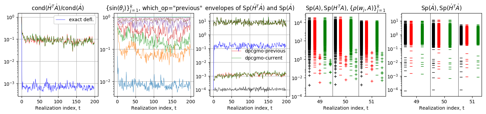


_Example05_a4_ (`sig2`=`0.50`; `L`=`0.02`; `model`=`"Exp"`; `kl`=`20`; `kl_strategy`=`1`; `ell_min`=`kl/4`; `nsmp`=`2000`; `t_end_def`=`0`; `t_end_kl`=`500`; `t_switch_to_mc`=`500`; `ini_W`=`False`, `precond_id`=`3`):


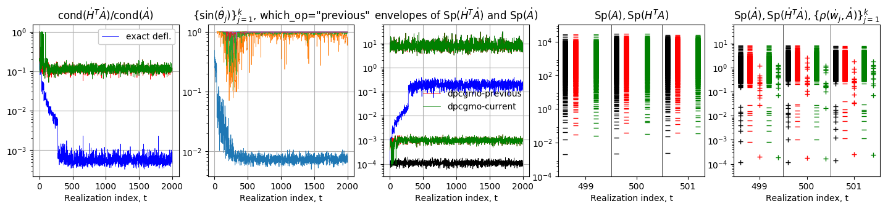

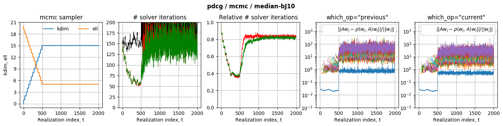

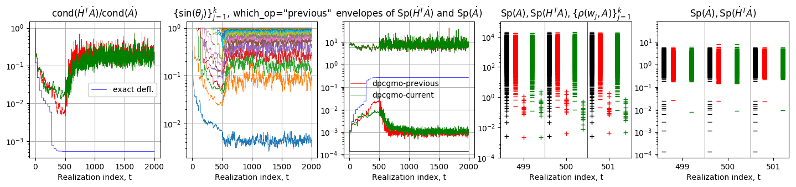


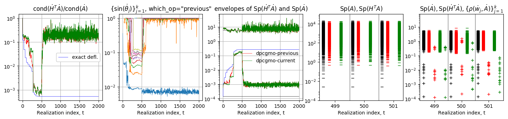


_Example05_a4_ (`sig2`=`0.50`; `L`=`0.02`; `model`=`"Exp"`; `kl`=`20`; `kl_strategy`=`1`; `ell_min`=`kl/4`; `nsmp`=`2000`; `t_end_def`=`0`; `t_end_kl`=`500`; `t_switch_to_mc`=`500`; `ini_W`=`False`, `precond_id`=`3`):


_Example05_b_ (`sig2`=`0.05`; `L`=`0.02`; `model`=`"Exp"`; `kl`=`20`; `kl_strategy`=`0`; `ell_min`=`kl/2`; `nsmp`=`200`; `t_end_def`=`0`; `t_end_kl`=`0`; `t_switch_to_mc`=`0`; `ini_W`=`False`, `precond_id`=`1`):


_Example05_b2_ (`sig2`=`0.05`; `L`=`0.02`; `model`=`"Exp"`; `kl`=`20`; `kl_strategy`=`1`; `ell_min`=`kl/2`; `nsmp`=`2000`; `t_end_def`=`0`; `t_end_kl`=`500`; `t_switch_to_mc`=`1000`; `ini_W`=`False`, `precond_id`=`1`):


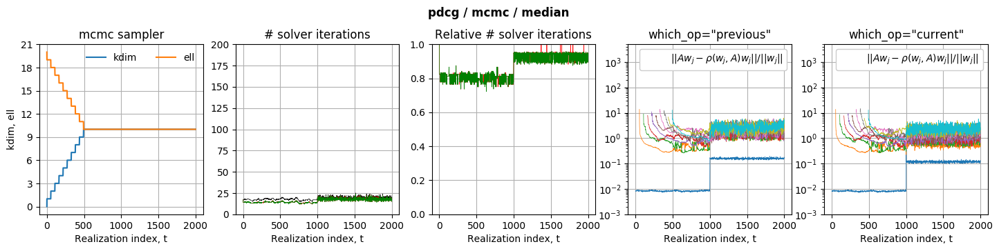


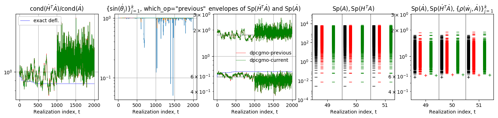


_Example05_c_ (`sig2`=`0.05`; `L`=`0.02`; `model`=`"Exp"`; `kl`=`20`; `kl_strategy`=`0`; `ell_min`=`kl/2`; `nsmp`=`200`; `t_end_def`=`0`; `t_end_kl`=`0`; `t_switch_to_mc`=`0`; `ini_W`=`False`, `precond_id`=`2`):


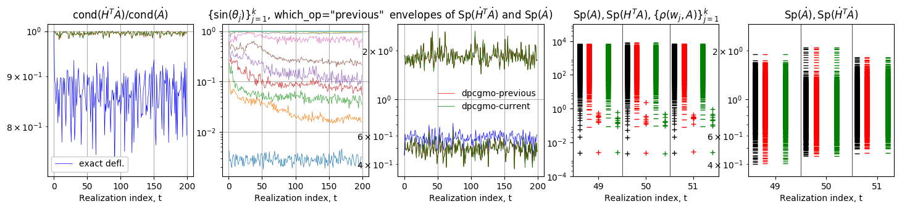


_Example05_c2_ (`sig2`=`0.05`; `L`=`0.02`; `model`=`"Exp"`; `kl`=`20`; `kl_strategy`=`1`; `ell_min`=`kl/4`; `nsmp`=`200`; `t_end_def`=`0`; `t_end_kl`=`1000`; `t_switch_to_mc`=`1200`; `ini_W`=`False`, `precond_id`=`2`):


_Example05_c3_ (`sig2`=`0.05`; `L`=`0.02`; `model`=`"Exp"`; `kl`=`20`; `kl_strategy`=`0`; `ell_min`=`kl/4`; `nsmp`=`200`; `t_end_def`=`0`; `t_end_kl`=`0`; `t_switch_to_mc`=`0`; `ini_W`=`False`, `precond_id`=`2`):


_Example05_c4_ (`sig2`=`0.05`; `L`=`0.02`; `model`=`"Exp"`; `kl`=`20`; `kl_strategy`=`0`; `ell_min`=`3*kl/4`; `nsmp`=`200`; `t_end_def`=`0`; `t_end_kl`=`0`; `t_switch_to_mc`=`0`; `ini_W`=`False`, `precond_id`=`2`):


_Example05_c5_ (`sig2`=`0.05`; `L`=`0.02`; `model`=`"Exp"`; `kl`=`20`; `kl_strategy`=`0`; `ell_min`=`3*kl/4`; `nsmp`=`2000`; `t_end_def`=`500`; `t_end_kl`=`0`; `t_switch_to_mc`=`500`; `ini_W`=`False`, `precond_id`=`2`):


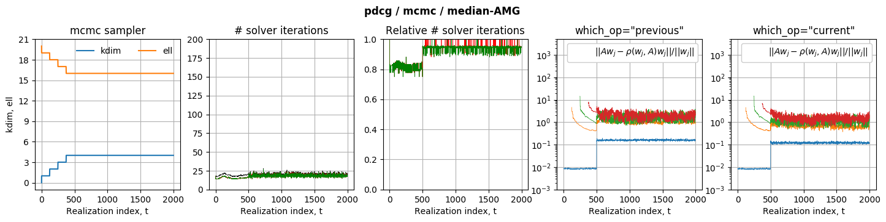


_Example05_c6_  (`sig2`=`0.50`; `L`=`0.02`; `model`=`"Exp"`; `kl`=`20`; `kl_strategy`=`0`; `ell_min`=`kl/2`; `nsmp`=`200`; `t_end_def`=`0`; `t_end_kl`=`0`; `t_switch_to_mc`=`0`; `ini_W`=`False`, `precond_id`=`2`):


_Example05_c7_  (`sig2`=`0.50`; `L`=`0.02`; `model`=`"Exp"`; `kl`=`20`; `kl_strategy`=`0`; `ell_min`=`kl/4`; `nsmp`=`200`; `t_end_def`=`0`; `t_end_kl`=`0`; `t_switch_to_mc`=`0`; `ini_W`=`False`, `precond_id`=`2`):


_Example05_c8_  (`sig2`=`0.50`; `L`=`0.02`; `model`=`"Exp"`; `kl`=`20`; `kl_strategy`=`0`; `ell_min`=`kl/4`; `nsmp`=`2000`; `t_end_def`=`0`; `t_end_kl`=`500`; `t_switch_to_mc`=`500`; `ini_W`=`False`, `precond_id`=`2`):


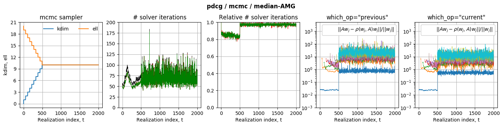


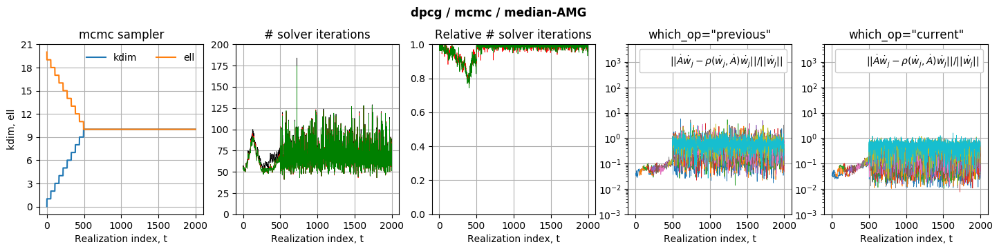


_Example05_c9_  (`sig2`=`0.50`; `L`=`0.02`; `model`=`"Exp"`; `kl`=`20`; `kl_strategy`=`0`; `ell_min`=`kl/4`; `nsmp`=`2000`; `t_end_def`=`500`; `t_end_kl`=`500`; `t_switch_to_mc`=`500`; `ini_W`=`False`, `precond_id`=`2`):


_Example05_c10_ (`sig2`=`0.50`; `L`=`0.02`; `model`=`"Exp"`; `kl`=`20`; `kl_strategy`=`0`; `ell_min`=`kl/2`; `nsmp`=`200`; `t_end_def`=`0`; `t_end_kl`=`0`; `t_switch_to_mc`=`0`; `ini_W`=`False`, `precond_id`=`2`):


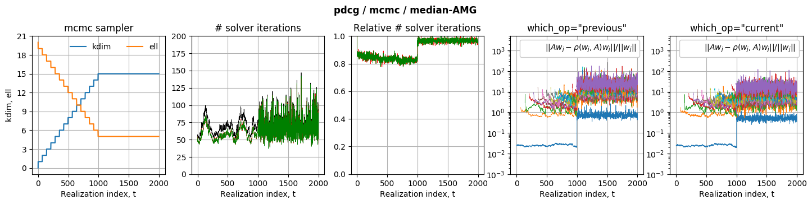


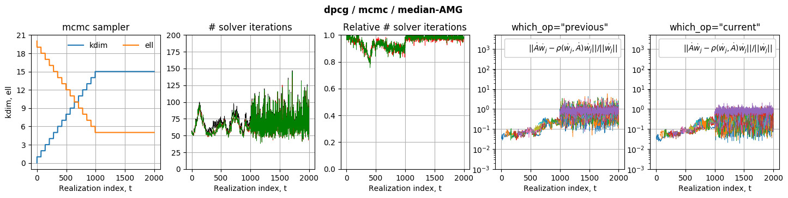

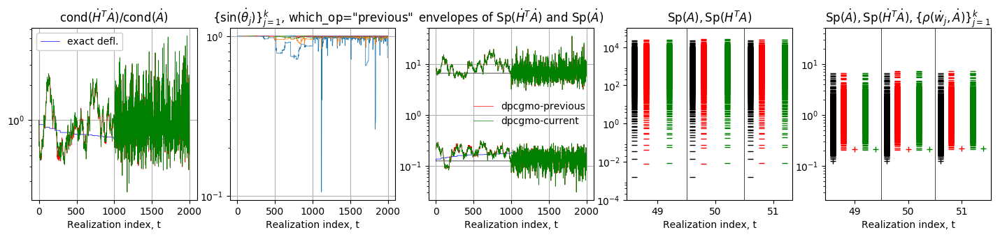


__Observations:__ 

First, in comparison to a resolution by PCG, `which_op` does not significantly impact the numbers of iterations gained by strategies combining deflation with preconditioning---this is true independently of `dp_seq`, the preconditioner used, and the sampling strategy. Second, MCMC sampled chains allow for more iteration gains per realization than their MC counterpart. 

In cases where median and median-AMG are used as preconditioners, the iterations gains vary from close to none to relatively low. In particular, no improvement is observed when sampling by MC, while MCMC sampled chains lead to better iteration gains when the preconditioner is applied to an already deflated operator, i.e. when `seq_dp`=`"dpcgmo-pd"` as opposed to `"dpcgmo-dp"`. 

When median-bJ10 is used, the observed iteration gains are far more substantial owing to the trail of isolated eigenvalues left in the lower of part of the spectrum by the action of the preconditioner. In this case, a MC sampled sequence does result in some iteration gains; and the relative gain obtained with `seq_dp`=`"dpcgmo-dp"` is by far more realization dependent than the rather stable gains obtained with `seq_dp`=`"dpcgmo-pd"`. The effect of deflation is, again, more significant when applied to MCMC sampled sequences. The relative gains obtained are more important and less realization dependent. However, the difference between deflating before preconditioning versus the opposite is not as clear in the case of this MCMC sampled sequence.