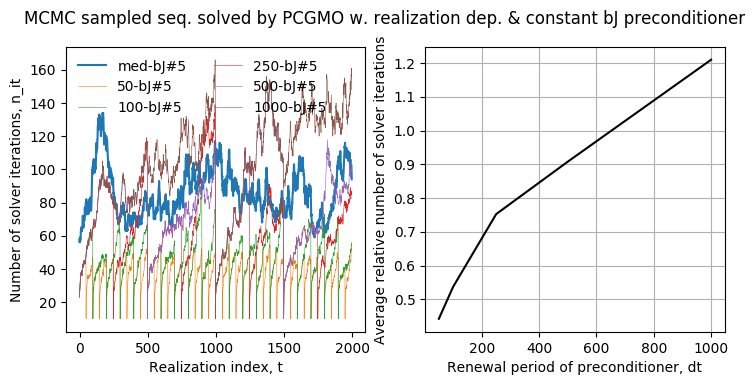
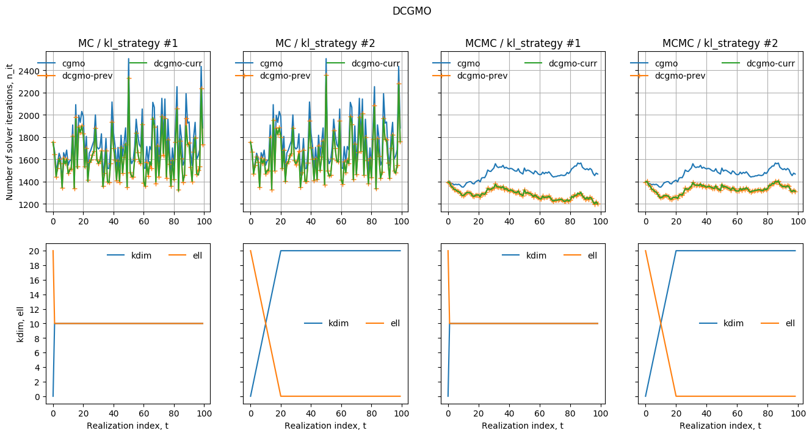

# deflation-precond-strategies-sde

#### Enables testing and applications of deflation and preconditioning strategies to solve sequences of sampled finite element (FE) discretization of stochastic differential equations (SDE).

Author: Nicolas Venkovic

email: [venkovic@cerfacs.fr](mailto:venkovic@cerfacs.fr)

_TeX expressions rendered by [TeXify](https://github.com/apps/texify)._

### Dependencies:

 - *Python* (2.x >= 2.6)
 - *SciPy* (>= 0.11)
 - *NumPy* (>= 1.6)

### Files' content:

List of files: _samplers.py_, _solvers.py_, _recyclers.py_, _post_recyclers.py_

- _samplers.py_ : 

  A `sampler` assembles sampled operators in a sequence $\{\mathbf{A}(\theta_t)\}_{t=1}^M$ for the stochastic system $\mathbf{A}(\theta)\mathbf{u}(\theta)=\mathbf{b}$ of a P0-FE discretization of the SDE $\partial_x[\kappa(x;\theta)\partial_xu(x;\theta)]=-f(x)$ for all $x\in(x_a, x_b)$ and $u(x_a)=0$. The stationary lognormal coefficient field $\kappa(x;\theta)$ is represented by a truncated Karhunen-Loève (KL) expansion later sampled either by Monte Carlo (MC) or by Markov chain Monte Carlo (MCMC).

  Signature : `sampler`(`nEL`=`500`,`smp_type`=`"mc"`, `model`=`"SExp"`, `sig2`=`1`, `mu`=`0`, `L`=`0.1`, `vsig2`=`None`,`delta2`=`1e-3`, `seed`=`123456789`, `verb`=`1`, `xa`=`0`, `xb`=`1`, `u_xb`=`None`, `du_xb`=`0`)

  - `nEl` (`int`, `nEl`>`0`) : Number of elements.

  - `smp_type` (`string`, {`"mc"` , `"mcmc"`}) : Sampling strategy of the KL expansion.

  - `model` (`string`, {`"SExp"`, `"Exp"`}) : Covariance model.

    `"SExp"` : Square exponential model.

    `"Exp"` : Exponential model.

  - `sig2` (`float`, `sig2`>`0`) : Variance.

  - `mu` (`float`) : Mean.

  - `L` (`float`, `L`>`0`) : Correlation length.

  - `delta2` (`float`, `0`<`delta2`<`1`) : Tolerance for the relative error in variance of the truncated KL representation. Used to evaluate the number `nKL`<`nEL` of terms kept in the expansion.

  - `seed` (`int`, `seed`>=`0`) : RNG seed.

  - `verb` (`int`, {`0`,`1`, `2`}) : Verbose parameter.

    - `0` : No standard output, new KL expansion not saved.
    - `1` : No standard output, new KL expansion saved in file.
    - `2` : Basic standard output, new KL expansion saved in file.

  - `vsig2` (`float`, `vsig2`>`0`) : Variance of the random walk for the proposal of the MCMC sampler. If `None`, eventually set to `2.38**2/nKL`.

  - `xa`, `xb` (`float`, `xa`<`xb`) : Domain extent.

  - `u_xb`, `du_xb` (`float`) : $u(x_b)$ and $\partial_xu(x_b)$. `u_xb` must be `None` if `du_xb`!=`None`. `du_xb` must be `None` if `u_xb`!=`None`.

- _solvers.py_ :

  A `solver` solves a linear system iteratively.

  Signature : `solver`( `n`, `solver_type`, `eps`=`1e-7`, `itmax`=`2000`, `W`=`None`)

  - `n` (`int`, `n`>`1`) : System size.
  - `solver_type` (`string`, {`"cg"`, `"pcg"`, `"dcg"`, `"dpcg"`}) : Type of iterative solver.
    - `cg` : Conjugate gradient.
    - `pcg` : Preconditioned conjugate gradient.
    - `dcg` : Deflated conjugate gradient.
    - `pdcg` : Preconditioned deflated conjugate gradient.
  - `eps` (`float`, `0`<`eps`<`1`) : Tolerance.
  - `itmax` (`int`, `itmax`>`1`) : Maximum number of iterations.
  - `W` (`ndarray`, `W.shape`=`(n,k)`, `k`<`n`) : Basis of deflation subspace.

  Public parameters : `set_precond`, `solve`.

  Public methods : `set_precond`, `solve`.

- _recyclers.py_ : 

  A `recycler` interfaces a `sampler` with a `solver` in order to solve a sequence of linear systems $\mathbf{A}(\theta_t)\mathbf{u}(\theta_t)=\mathbf{b}$  associated with a sequence of sampled operators $\{\mathbf{A}(\theta_t)\}_{t=1}^M$. The recyclers implemented make use of preconditioners and/or deflation of Krylov subspaces. 

  The available sequences of preconditioners $\{\mathbf{M}(\theta_t)\}_{t=1}^M$ are either: (1) constant, i.e.  $\mathbf{M}(\theta_t)=\mathbf{M}(\hat{\mathbf{A}})$ for all $t$, where $\hat{\mathbf{A}}$ denotes the median operator, or (2) realization-dependent and redefined periodically throughout the sampled sequence, i.e. $\mathbf{M}(\theta_t):=\mathbf{M}(\theta_{t_j})$ for all $t_j\leq t<t_{j+1}$ with $t_j:=1+j\Delta t$ and $0\leq j<M/\Delta t$ for some period $\Delta t$.  All the preconditioners available are SPD so that for each $\mathbf{M}(\theta_t)$, there exists $\mathbf{L}(\theta_t)$ such that $\mathbf{M}(\theta_t)=\mathbf{L}(\theta_{t})\mathbf{L}(\theta_{t})^{T}$.

  Deflation is performed either: (1) throughout the sequence, or (2) for all $t\leq t_{stop}$ for some $t_{stop}\leq M$. The Krylov subspace $\mathcal{K}^{(t)}$ associated with the iterative resolution of $\mathbf{A}(\theta_t)\mathbf{u}(\theta_t)=\mathbf{b}$  is deflated by a subspace $\mathcal{W}(\theta_t):=\mathcal{R}(\mathbf{W}(\theta_t))$ spanned by $\mathbf{W}(\theta_t):=[\mathbf{w}_1(\theta_t),\dots,\mathbf{w}_k(\theta_t)]$. $\{\mathbf{w}_k(\theta_t)\}_{j=1}^k$ are approximate eigenvectors of either $\mathbf{A}(\theta_{t-1})$, $\mathbf{A}(\theta_t)$, $\mathbf{M}^{-1}(\theta_{t-1})\mathbf{A}(\theta_{t-1})$ or $\mathbf{M}^{-1}(\theta_{t})\mathbf{A}(\theta_{t})$ depending on the deflation strategy adopted and whether a preconditioner is used or not.

  The approximated eigenvectors $\mathbf{w}_1(\theta_t),\dots,\mathbf{w}_k(\theta_t)$ are obtained by (1) Harmonic Ritz, and/or (2) Rayleigh Ritz analysis over an approximation subspace $\mathcal{R}([\mathbf{W}(\theta_{t-1}),\mathbf{P}(\theta_{t-1})])$ spanned by a (recycled) basis $\mathbf{P}(\theta_{t-1})\in\mathbb{R}^{n\times\ell}$ of the Krylov subspace $\mathcal{K}^{(t-1)}_{\ell}\subseteq\mathcal{K}^{(t-1)}$, and the basis $\mathbf{W}(\theta_{t-1})\in\mathbb{R}^{n\times k}$ of a deflation subspace $\mathcal{W}^{(t-1)}\perp\mathcal{K}^{(t-1)}$. The dimensions $k$ and $\ell$ are respectively denoted by `kdim` and `ell` throughout the code.

  A `recycler` recycles.

  Signature : `recycler`(`sampler`, `solver`, `recycler_type`, `dt`=`0`, `t_end_def`=`0`, `kl`=`5`, `kl_strategy`=`0`, `dp_seq`=`"pd"`, `which_op`=`"previous"`, `approx`=`"HR"`)

  - PCG for a sequence with multiple operators, `pcgmo` :

    Signature : `pcgmo`(`M`, `precond_id`=`0`, `nb`=`1`, `real_dep_precond`=`False`, `dt`=`1`) 

    - `precond_id` (`int`) : 

      `0` : No preconditioner.

      `1` : Median operator.

      `2` : Algebraic multi-grid (AMG) based on median operator.

      `3` : Block Jacobi (bJ) based on median operator with `nb` (non-overlapping) blocks.

    - `nb` (`int`) : Number of blocks for the bJ preconditioner.

    - `real_dep_precond` (`bool`) : If `True`, the preconditoner is redefined every `dt` realizations in the sampled sequence.

    - `dt` (`int`) : Period.

  - DCG for a sequence with multiple operators, `dcgmo` :

    Signature : `dcgmo`(`M`, `precond_id`=`0`, `nb`=`1`, `real_dep_precond`=`False`) 

    - kdim_ell_strategy (int) : Strategy

  - Dimension of recycled.

    - `kdim_ell_strategy` (int, default value : `0`)

      `0` : First strategy

      `1` : Second strategy

    - Current/previous

    - Stop updating

    - HR vs RR

  - DPCG for a sequence with multiple operators, `dpcgmo` :

    Signature : `dpcgmo`(`M`, `precond_id`=`0`, `nb`=`1`, `real_dep_precond`=`False`) 

    - Sequence (PD: 1, DP: 2)

      (1) PD is preconditioning after deflating

      (2) DP is deflating after preconditioning

    - Preconditioner ID

    - (_k_, _ell_)-strategy

    - Current/Previous

    - HR vs RR

    - Stop updating

  Public parameters : a, b, c.

  Public methods : a, b, c.

- _post-recyclers.py_ :

  A `post_recycler` is *.

  List of `post_recycler` available:

  - Plots results


### Usage:

#### Example #1: example01_sampler.py

Draws and plots realizations of the lognormal coefficient field $\kappa(x;\theta)$ with an exponential covariance sampled both by Monte Carle and Markov chain Monte Carlo.  

```python
from samplers import sampler
import pylab as pl

nEl = 1000
nsmp = 50
sig2, L = .357, 0.05
model = "Exp"

mc = sampler(nEl=nEl, smp_type="mc", model=model, sig2=sig2, L=L)
mc.compute_KL()

mcmc = sampler(nEl=nEl, smp_type="mcmc", model=model, sig2=sig2, L=L)
mcmc.compute_KL()

fig, ax = pl.subplots(1, 2, sharey=True, figsize=(8,3.7))
for i_smp in range(nsmp):
  mc.draw_realization()
  ax[0].plot(mc.get_kappa(), lw=.1)

while (mcmc.cnt_accepted_proposals < nsmp):
  mcmc.draw_realization()
  if (mcmc.proposal_accepted):
    ax[1].plot(mcmc.get_kappa(), lw=.1)
ax[0].set_ylabel("kappa(x;theta_t)")
ax[0].set_xlabel("x"); ax[1].set_xlabel("x")
ax[0].set_title("MC sampler")
ax[1].set_title("MCMC sampler")
pl.show()
```

Output :


#### Example #2: example02_solver.py

Solves $\partial_x[\kappa(x;\theta)\partial_xu(x;\theta)]=-f(x)$ for all $x\in(x_a, x_b)$ with $u(x_a)=0$ and $u(x_b)=0.005$. The sequence $\{\kappa(x;\theta_t)\}_{t=1}^M$ is sampled both by Monte Carle and Markov chain Monte Carlo.  In both cases, the corresponding sequence $\{u(x;\theta_t)\}_{t=1}^M$ is obtained after FE discretization and PCG resolutions using a block Jacobi (bJ) preconditioner based on the median operator with 10 blocks.

```python
from samplers import sampler
from solvers import solver
import numpy as np
import pylab as pl

nEl = 1000
nsmp = 50
sig2, L = .357, 0.05
model = "Exp"

mc = sampler(nEl=nEl, smp_type="mc", model=model, sig2=sig2, L=L, u_xb=0.005, du_xb=None)
mc.compute_KL()

mcmc = sampler(nEl=nEl, smp_type="mcmc", model=model, sig2=sig2, L=L, u_xb=0.005, du_xb=None)
mcmc.compute_KL()

pcg = solver(n=mc.n, solver_type="pcg")
pcg.set_precond(Mat=mc.get_median_A(), precond_id=3, nb=10)

fig, ax = pl.subplots(2, 3, figsize=(13,8.))
for i_smp in range(nsmp):
  mc.draw_realization()
  mc.do_assembly()
  pcg.solve(A=mc.A, b=mc.b, x0=np.zeros(mc.n))
  ax[0,0].plot(mc.get_kappa(), lw=.1)
  ax[0,1].plot(pcg.x, lw=.2)
  ax[0,2].semilogy(pcg.iterated_res_norm/pcg.bnorm, lw=.3)  
ax[0,0].set_title("kappa(x; theta_t)")
ax[0,1].set_title("u(x; theta_t)")
ax[0,2].set_title("||r_j||/||b||")
ax[0,0].set_ylabel("MC sampler")

while (mcmc.cnt_accepted_proposals < nsmp):
  mcmc.draw_realization()
  mcmc.do_assembly()
  if (mcmc.proposal_accepted):
    pcg.solve(A=mcmc.A, b=mcmc.b, x0=np.zeros(mcmc.n))
    ax[1,0].plot(mcmc.get_kappa(), lw=.1)
    ax[1,1].plot(pcg.x, lw=.2)
    ax[1,2].semilogy(pcg.iterated_res_norm/pcg.bnorm, lw=.3)  
ax[1,0].set_xlabel("x"); ax[1,1].set_xlabel("x"); ax[1,2].set_xlabel("Solver iteration, j")
ax[1,0].set_ylabel("MCMC sampler")

pl.show()
```

Output :


#### Example #3: example03_recycler.py

Solves the sequence $\{u(x;\theta_t)\}_{t=1}^M$ for a MCMC sampled sequence $\{\kappa(x;\theta_t)\}_{t=1}^M$. Every system is solved by PCG with both constant and realization-dependent bJ#5 preconditioners. The constant preconditioner is built on the basis of the median operator while the realization-dependent preconditioners are redefined periodically every `dt`={`200`,`500`} distinct realizations (i.e. discarding steps with rejected proposal) on the basis of the current operator in the sequence.

```python
from samplers import sampler
from solvers import solver
from recyclers import recycler
import pylab as pl
import numpy as np

nEl = 1000
nsmp = 1999
sig2, L = .357, 0.05
model = "Exp"

mcmc = sampler(nEl=nEl, smp_type="mcmc", model=model, sig2=sig2, L=L)
mcmc.compute_KL()

mcmc.draw_realization()
mcmc.do_assembly()

nb = 5
dt = [50, 100, 250, 500, 1000]
pcg_dtbJ = []
pcgmo_dtbJ = []

for i, dt_i in enumerate(dt):
  pcg_dtbJ += [solver(n=mcmc.n, solver_type="pcg")]
  pcg_dtbJ[i].set_precond(Mat=mcmc.A, precond_id=3, nb=nb)

pcg_medbJ  = solver(n=mcmc.n, solver_type="pcg")
pcg_medbJ.set_precond(Mat=mcmc.get_median_A(), precond_id=3, nb=nb)

for i, dt_i in enumerate(dt):
  pcgmo_dtbJ += [recycler(sampler=mcmc, solver=pcg_dtbJ[i], recycler_type="pcgmo", dt=dt_i)]
pcgmo_medbJ = recycler(sampler=mcmc, solver=pcg_medbJ, recycler_type="pcgmo")

pcgmo_dtbJ_it, pcgmo_medbJ_it = [[] for i in range(len(dt))], []
while (mcmc.cnt_accepted_proposals < nsmp):
  mcmc.draw_realization()
  if (mcmc.proposal_accepted):
    for i, dt_i in enumerate(dt):
      pcgmo_dtbJ[i].do_assembly()
      pcgmo_dtbJ[i].prepare()
      pcgmo_dtbJ[i].solve()
    
    pcgmo_medbJ.do_assembly()
    pcgmo_medbJ.prepare()
    pcgmo_medbJ.solve()

    for i, dt_i in enumerate(dt):
      pcgmo_dtbJ_it[i] += [pcg_dtbJ[i].it]
    pcgmo_medbJ_it += [pcg_medbJ.it]

fig, ax = pl.subplots(1, 2, figsize=(8.5,3.7))
ax[0].plot(pcgmo_medbJ_it, label="med-bJ#%d" %(nb))
for i, dt_i in enumerate(dt):
  ax[0].plot(pcgmo_dtbJ_it[i], label="%d-bJ#%d" %(dt_i,nb), lw=.4)
av_pcgmo_medbJ_it = np.mean(pcgmo_medbJ_it)
av_pcgmo_dtbJ_it = np.array([np.mean(pcgmo_it)/av_pcgmo_medbJ_it for pcgmo_it in pcgmo_dtbJ_it])
ax[1].plot(dt, av_pcgmo_dtbJ_it, "k")
ax[0].set_xlabel("Realization index, t"); ax[1].set_xlabel("Renewal period of preconditioner, dt")
ax[0].set_ylabel("Number of solver iterations, n_it")
ax[1].set_ylabel("Average relative number of solver iterations")
ax[0].legend(frameon=False, ncol=2)
fig.suptitle("MCMC / PCGMO / Realization dep. vs median bJ preconditioner")
pl.show()
```

Output :




#### Example #4: example04_recycler.py

Solves using a block Jacobi (bJ) preconditioner.  

```python
from samplers import sampler
from solvers import solver
import numpy as np
import pylab as pl


pl.show()
```

Output :



