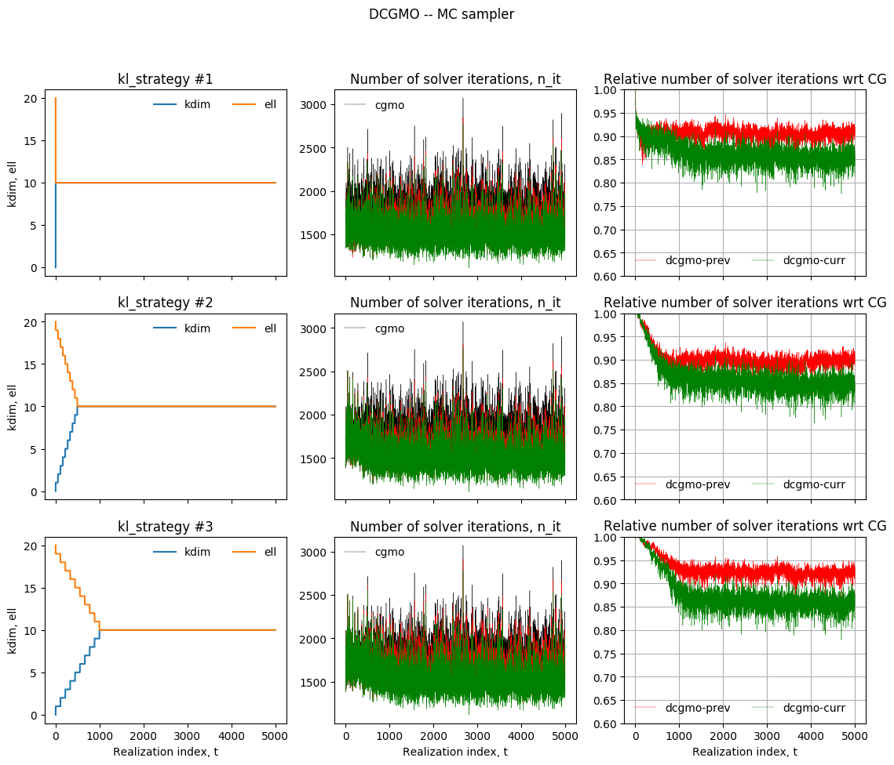
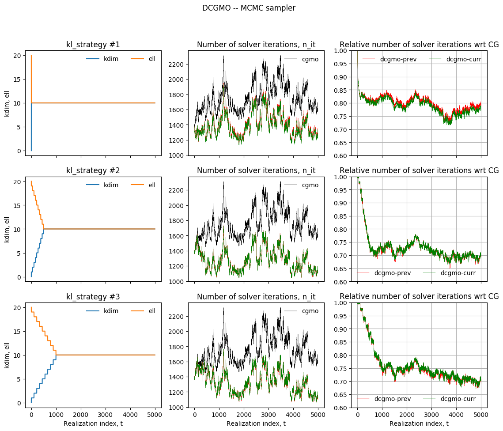
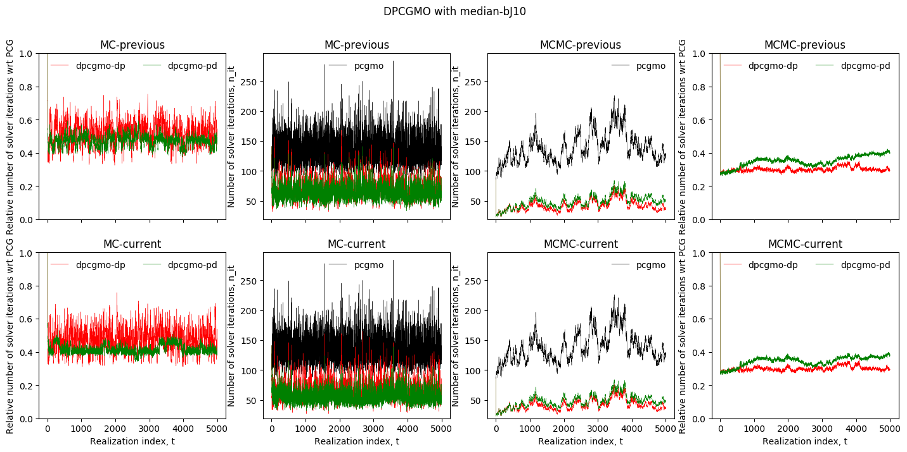
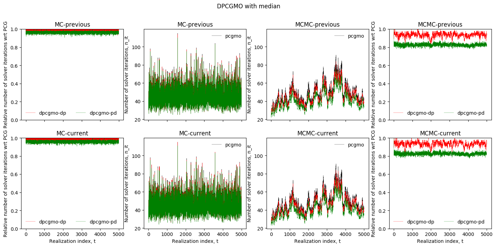
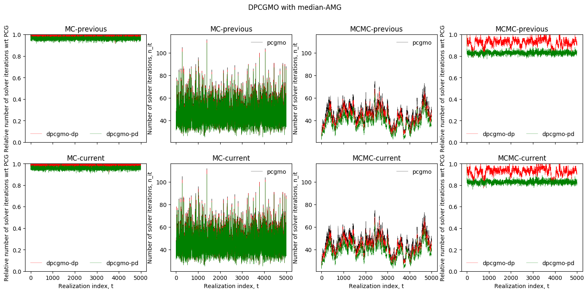

# deflation-precond-strategies-sde

#### Enables testing and applications of deflation and preconditioning strategies to solve sequences of sampled finite element (FE) discretizations of stochastic differential equations (SDE).

Author: Nicolas Venkovic

email: [venkovic@cerfacs.fr](mailto:venkovic@cerfacs.fr)

_TeX expressions rendered by [TeXify](https://github.com/apps/texify)._

### Dependencies:

 - *Python* (2.x >= 2.6)
 - *SciPy* (>= 0.11)
 - *NumPy* (>= 1.6)

### Files' content:

Files: _samplers.py_, _samplers_etc.py_, _solvers.py_, _solvers_etc.py_, _recyclers.py_, _post_recyclers.py_.

Classes: `sampler`, `solver`, `recycler`.

- _samplers.py_ : 

  Signature : `sampler`(`nEL`=`500`,`smp_type`=`"mc"`, `model`=`"SExp"`, `sig2`=`1`, `mu`=`0`, `L`=`0.1`, `vsig2`=`None`,`delta2`=`1e-3`, `seed`=`123456789`, `verb`=`1`, `xa`=`0`, `xb`=`1`, `u_xb`=`None`, `du_xb`=`0`)

  Assembles sampled operators in a sequence $\{\mathbf{A}(\theta_t)\}_{t=1}^M$ for the stochastic system $\mathbf{A}(\theta)\mathbf{u}(\theta)=\mathbf{b}$ of a P0-FE discretization of the SDE $\partial_x[\kappa(x;\theta)\partial_xu(x;\theta)]=-f(x)$ for all $x\in(x_a, x_b)$ and $u(x_a)=0$. The stationary lognormal coefficient field $\kappa(x;\theta)$ is represented by a truncated Karhunen-Loève (KL) expansion later sampled either by Monte Carlo (MC) or by Markov chain Monte Carlo (MCMC).

  - `nEl` (`int`, `nEl`>`0`) : Number of elements.

  - `smp_type` (`string`, {`"mc"` , `"mcmc"`}) : Sampling strategy of the KL expansion.

  - `model` (`string`, {`"SExp"`, `"Exp"`}) : Covariance model.

    `"SExp"` : Square exponential model.

    `"Exp"` : Exponential model.

  - `sig2` (`float`, `sig2`>`0`) : Variance.

  - `mu` (`float`) : Mean.

  - `L` (`float`, `L`>`0`) : Correlation length.

  - `delta2` (`float`, `0`<`delta2`<`1`) : Tolerance for the relative error in variance of the truncated KL representation. Used to evaluate the number `nKL`<`nEL` of terms kept in the expansion.

  - `seed` (`int`, `seed`>=`0`) : RNG seed.

  - `verb` (`int`, {`0`,`1`, `2`}) : Verbose parameter.

    - `0` : No standard output, new KL expansion not saved.
    - `1` : No standard output, new KL expansion saved in file.
    - `2` : Basic standard output, new KL expansion saved in file.

  - `vsig2` (`float`, `vsig2`>`0`) : Variance of the random walk for the proposal of the MCMC sampler. If `None`, eventually set to `2.38**2/nKL`.

  - `xa`, `xb` (`float`, `xa`<`xb`) : Domain extent.

  - `u_xb`, `du_xb` (`float`) : $u(x_b)$ and $\partial_xu(x_b)$. `u_xb` must be `None` if `du_xb`!=`None`. `du_xb` must be `None` if `u_xb`!=`None`.


  Public methods : `compute_KL`(`self`), `draw_realization`(`self`), `do_assembly`(`self`), `get_kappa`(`self`), `get_median_A`(`self`).

- _solvers.py_ :

  Signature : `solver`( `n`, `solver_type`, `eps`=`1e-7`, `itmax`=`2000`, `W`=`None`, `ell`=`0`)

  Solves a linear system iteratively and potentially recycles some information about a Krylov subspace.

  - `n` (`int`, `n`>`1`) : System size.
  - `solver_type` (`string`, {`"cg"`, `"pcg"`, `"dcg"`, `"dpcg"`}) : Type of iterative solver.
    - `cg` : Conjugate gradient.
    - `pcg` : Preconditioned conjugate gradient.
    - `dcg` : Deflated conjugate gradient.
    - `pdcg` : Preconditioned deflated conjugate gradient.
  - `eps` (`float`, `0`<`eps`<`1`) : Tolerance used for stopping criterion. Iterations are stopped if the norm `iterated_res_norm` of the iterated residual `r` is such that `iterated_res_norm`<`eps`*`bnorm` where `bnorm` denotes $\|b\|$.
  - `itmax` (`int`, `itmax`>`1`) : Maximum number of iterations.
  - `W` (`ndarray`, `W.shape`=`(n,k)`, `k`<`n`) : Basis of deflation subspace used for `"dcg"` and `"dpcg"`.
  - `ell` (`int`, `ell`>`0`) : Attempted dimension of the Krylov subspace to recycle.


  Public methods : `set_precond`, `presolve`, `apply_invM`, `solve`.

  Signature : `set_precond`(`self`, `Mat`, `precond_id`, `nb`=`2`, `application_type`=`1`)

  - `Mat` ({`ndarray`, `sparse`}, `Mat.shape`=`(n, n)`) : Array used to define a preconditioner.

  - `precond_id` (`int`, {`1`, `2`, `3`}) : Preconditioner ID: 

    `1` : Preconditioner is `Mat`.

    `2` : Precondiotioner is an algebraic multi-grid (AMG) solver of a system defined with `Mat`.

    `3` : Preconditioner is Block Jacobi (bJ) based on `Mat` with `nb` (non-overlapping) blocks.

  - `nb` (`int`, `0`<`nb`<`n`) : Number of blocks for the bJ preconditioner, only used for `precond_id`=`3`.

  - `application_type` (`int`, {`0`, `1`, `2`}) : Way the inverse preconditioner is applied. Does not apply for `precond_id` =`2`.

    `0` : Resolution of a linear system from scratch using an appropriate solver each time the inverse preconditoner is applied. Apply inverse preconditioner to `x` as follows:

    - `Mat` is `ndarray` : `scipy.linalg.solve`(`M`, `x`).
    - `Mat` is `sparse` : `scipy.sparse.linalg.spsolve`(`M`, `x`).

    `1` : An appropriate  factorization is computed and stored when `set_precond` is called. Then, the factorization is used each time the inverse preconditoner is applied.

    - `Mat` is `ndarray` : Factorize `M` with `scipy.linalg.cho_factor`(`M`, `x`).
    - `Mat` is `sparse` : Factorize `M` with `scipy.sparse.linalg.factorized`(`M`, `x`).

    `2` : The array of the inverse preconditioner is explicitly computed when `set_precond` is called. The computed inverse is later applied as a matrix-vector product at each application.

  Signature : `presolve`(`self`, `A`, `b`, `ell`=`0`)

  If `self.type`={`"dcg"`, `"dpcg"`} : Computes $AW$ and computes/factorizes $W^TAW$.

  - `A` ({`ndarray`, `sparse`}, `A.shape`=`(n, n)`) : Sampled operator of linear system to solve.
  - `b` (`ndarray`, `b.shape`=`(n,)`) : Right hand side.
  - `ell` (`int`, `ell`>=`0`) : Dimension of Krylov subspace to recycle

  Signature : `apply_invM`(`self`, `x`)

- `x` (`ndarray`, `x.shape`=`(n,)`) : Vector.

  Signature : `solve`(`self`, `x0`, `x_sol`=`None`)

  - `x0` (`ndarray`, `x0.shape`=`(n,)`) : Initial iterate.

  - `x_sol` (`ndarray`, `x_sol.shape`=`(n,)`) : Exact solution used to compute A-norm errors.

- _recyclers.py_ : 

  Signature : `recycler`(`sampler`, `solver`, `recycler_type`, `dt`=`0`, `t_end_def`=`0`, `kl`=`5`, `kl_strategy`=`0`, `dp_seq`=`"pd"`, `which_op`=`"previous"`, `approx`=`"HR"`)

  Interfaces a `sampler` with a `solver` in order to solve a sequence of linear systems $\mathbf{A}(\theta_t)\mathbf{u}(\theta_t)=\mathbf{b}$  associated with a sequence of sampled operators $\{\mathbf{A}(\theta_t)\}_{t=1}^M$. The recyclers implemented make use of preconditioners and/or deflation of Krylov subspaces. 

  The available sequences of preconditioners $\{\mathbf{M}(\theta_t)\}_{t=1}^M$ are either: (1) constant, i.e.  $\mathbf{M}(\theta_t)=\mathbf{M}(\hat{\mathbf{A}})$ for all $t$, where $\hat{\mathbf{A}}$ denotes the median operator, or (2) realization-dependent and redefined periodically throughout the sampled sequence, i.e. $\mathbf{M}(\theta_t):=\mathbf{M}(\theta_{t_j})$ for all $t_j\leq t<t_{j+1}$ with $t_j:=1+j\Delta t$ and $0\leq j<M/\Delta t$ for some period $\Delta t$.  All the preconditioners available are SPD so that for each $\mathbf{M}(\theta_t)$, there exists $\mathbf{L}(\theta_t)$ such that $\mathbf{M}(\theta_t)=\mathbf{L}(\theta_{t})\mathbf{L}(\theta_{t})^{T}$.

  Deflation is performed either: (1) throughout the sequence, or (2) for all $t\leq t_{stop}$ for some $t_{stop}\leq M$. The Krylov subspace $\mathcal{K}^{(t)}$ associated with the iterative resolution of $\mathbf{A}(\theta_t)\mathbf{u}(\theta_t)=\mathbf{b}$  is deflated by a subspace $\mathcal{W}(\theta_t):=\mathcal{R}(\mathbf{W}(\theta_t))$ spanned by $\mathbf{W}(\theta_t):=[\mathbf{w}_1(\theta_t),\dots,\mathbf{w}_k(\theta_t)]$. $\{\mathbf{w}_k(\theta_t)\}_{j=1}^k$ are approximate eigenvectors of either $\mathbf{A}(\theta_{t-1})$, $\mathbf{A}(\theta_t)$, $\mathbf{M}^{-1}(\theta_{t-1})\mathbf{A}(\theta_{t-1})$ or $\mathbf{M}^{-1}(\theta_{t})\mathbf{A}(\theta_{t})$ depending on the deflation strategy adopted and whether a preconditioner is used or not.

  The approximated eigenvectors $\mathbf{w}_1(\theta_t),\dots,\mathbf{w}_k(\theta_t)$ are obtained by (1) Harmonic Ritz, and/or (2) Rayleigh Ritz analysis over an approximation subspace $\mathcal{R}([\mathbf{W}(\theta_{t-1}),\mathbf{P}(\theta_{t-1})])$ spanned by a (recycled) basis $\mathbf{P}(\theta_{t-1})\in\mathbb{R}^{n\times\ell}$ of the Krylov subspace $\mathcal{K}^{(t-1)}_{\ell}\subseteq\mathcal{K}^{(t-1)}$, and the basis $\mathbf{W}(\theta_{t-1})\in\mathbb{R}^{n\times k}$ of a deflation subspace $\mathcal{W}^{(t-1)}\perp\mathcal{K}^{(t-1)}$. The dimensions $k$ and $\ell$ are respectively denoted by `kdim` and `ell` throughout the code.

  - `sampler` (`sampler`) 
  - `solver` (`solver`) 
  - `recycler_type` (`string`, {`"pcgmo"`, `"dcgmo"`, `"dpcgmo"`}) : Type of recycling or preconditioning strategy used to solve the sampled sequence of linear systems. Needs to be compatible with `solver.type` and `sampler.type`. Valid combinations are : 
    - `sampler.type`=`"mcmc"` ; `solver.type`=`"pcg"` ; `recycler-type`=`"pcgmo"`.
    - `sampler.type`={`"mc"`, `"mcmc"`} ; `solver.type`= `"dcg"` ; `recycler-type`= `"dcgmo"`.
    - `sampler.type`={`"mc"`, `"mcmc"`} ; `solver.type`= `"dpcg"` ; `recycler-type`= `"dpcgmo"`.
  - `dt` (`int`, `dt`>=`0`) : Renewal period of the preconditioner used for `"pcgmo"`.  If `dt`=`0`, there is no renewal, i.e. the preconditioner is constant throughout the sequence.
  - `t_end_def` (`int`, `t_end_def`>=`0`) : Number of realizations (resp. distinct realizations for `sampler.type`=`"mcmc"`) beyond which the deflation subspace is not updated any more. For`t_end_def`=`0` , there is no interruption and a new deflation subspace is generated at each  (resp. distinct) realization.
  - `kl` (`int`, `kl`>=`0`) : Upper bound on the sum of the dimensions `kdim`  and `ell` of the deflation and recycled Krylov subspaces, respectively.
  - `kl_strategy` (`int`, {`0`, `1`}) : Strategy used to update the dimensions `kdim`  and `ell` of the deflation and recycled Krylov subspaces, respectively, at each (resp. distinct) realizations in the sampled sequence.
    - `0` : `kdim`=`kl`/2, `ell`=`kl`-`kdim`.
    - `1` : kdim increases while ell decreases.
  - `dp_seq` (`string`, {`"pd"`, `"dp"`}) : Deflation-preconditioning sequence for `"dpcgmo"` :
    - `"pd"` : Precondition after deflating.
    - `"dp"` : Deflate after preconditioning.
  - `which_op` (`string`, {`"previous"`, `"current"`}) : Operator whose eigenvectors are approximated to construct a deflation subspace to be used for a current linear system : 
    - `"previous"` : Previous (resp. last distinct) operator in the sequence.
    - `"current"` : Current operator.
  - `approx` (`string`, {`"HR"`, `"RR"`}) : Method used for the eigenvector approximation :
    - `"HR"` : Harmonic Ritz analysis---best suited to approximate least dominant LD eigenpairs.
    - `"RR"` : Rayleigh Ritz analysis---best suited to approximate most dominant MD eigenpairs.


  Public methods : `do_assembly`, `prepare`, `solve`.

  Signature `do_assembly`(`self`)

  Assembles current operator $A$ from sampled realization.

  Signature `prepare `(`self`)

  If `self.type`=`"pcgmo"` : Updates preconditioner and computes new factorization.

  If `self.type`={`"dcgmo"`, `"dpcgmo"`} : Updates deflation subspace, computes $AW$, and computes/factorizes $W^TAW$.

  Signature : `solve`(`self`, `x0`)

  Solves the current system in the the sequence.

  - `x0` (`ndarray`, `x0.shape`=`(n,)`) : Initial iterate, later projected onto the orthogonal complement of the deflation subspace if `self.type`={`"dcgmo"`, `"dpcgmo"`}.


### Usage:

Examples:

- _example01_sampler.py_ : Shows how to use the `sampler` class to sample by MC and MCMC.
- _example02_solver.py_ : Shows how to use the `solver` class to solve MC and MCMC sampled sequences of systems by PCG.
- _example03_recycler.py_ : Shows how to use the `recycler` class to solve a MCMC sampled sequences of systems by PCGMO using constant and realization-dependent preconditioners. 
- _example04_recycler.py_ : Shows the effect of `kl_strategy` and `which_op` on DCGMO results for sequences of systems sampled by MC, and by MCMC.
- _example05_recycler.py_ : Shows the effect of `t_end_def` on DPCGMO.
- _example06_recycler.py_ : Shows the effect of `dp_seq` on DPCGMO.

#### Example #1: example01_sampler.py

Draws and plots realizations of the lognormal coefficient field $\kappa(x;\theta)$ with an exponential covariance sampled by Monte Carlo, and by Markov chain Monte Carlo.  

```python
from samplers import sampler
import pylab as pl

nEl = 1000
nsmp = 50
sig2, L = .357, 0.05
model = "Exp"

mc = sampler(nEl=nEl, smp_type="mc", model=model, sig2=sig2, L=L)
mc.compute_KL()

mcmc = sampler(nEl=nEl, smp_type="mcmc", model=model, sig2=sig2, L=L)
mcmc.compute_KL()

fig, ax = pl.subplots(1, 2, sharey=True, figsize=(8,3.7))
for i_smp in range(nsmp):
  mc.draw_realization()
  ax[0].plot(mc.get_kappa(), lw=.1)

while (mcmc.cnt_accepted_proposals < nsmp):
  mcmc.draw_realization()
  if (mcmc.proposal_accepted):
    ax[1].plot(mcmc.get_kappa(), lw=.1)
ax[0].set_ylabel("kappa(x;theta_t)")
ax[0].set_xlabel("x"); ax[1].set_xlabel("x")
ax[0].set_title("MC sampler")
ax[1].set_title("MCMC sampler")
pl.show()
```

Output :


#### Example #2: example02_solver.py

Solves $\partial_x[\kappa(x;\theta)\partial_xu(x;\theta)]=-f(x)$ for all $x\in(x_a, x_b)$ with $u(x_a)=0$ and $u(x_b)=0.005$. The sequence $\{\kappa(x;\theta_t)\}_{t=1}^M$ is sampled by Monte Carlo, and by Markov chain Monte Carlo.  In both cases, the corresponding sequence $\{u(x;\theta_t)\}_{t=1}^M$ is obtained after FE discretization and PCG resolutions using a block Jacobi (bJ) preconditioner based on the median operator with 10 blocks.

```python
from samplers import sampler
from solvers import solver
import numpy as np
import pylab as pl

nEl = 1000
nsmp = 50
sig2, L = .357, 0.05
model = "Exp"

mc = sampler(nEl=nEl, smp_type="mc", model=model, sig2=sig2, L=L, u_xb=0.005, du_xb=None)
mc.compute_KL()

mcmc = sampler(nEl=nEl, smp_type="mcmc", model=model, sig2=sig2, L=L, u_xb=0.005, du_xb=None)
mcmc.compute_KL()

pcg = solver(n=mc.n, solver_type="pcg")
pcg.set_precond(Mat=mc.get_median_A(), precond_id=3, nb=10)

fig, ax = pl.subplots(2, 3, figsize=(13,8.))
for i_smp in range(nsmp):
  mc.draw_realization()
  mc.do_assembly()
  pcg.presolve(A=mc.A, b=mc.b)
  pcg.solve(x0=np.zeros(mc.n))
  ax[0,0].plot(mc.get_kappa(), lw=.1)
  ax[0,1].plot(pcg.x, lw=.2)
  ax[0,2].semilogy(pcg.iterated_res_norm/pcg.bnorm, lw=.3)  
ax[0,0].set_title("kappa(x; theta_t)")
ax[0,1].set_title("u(x; theta_t)")
ax[0,2].set_title("||r_j||/||b||")
ax[0,0].set_ylabel("MC sampler")

while (mcmc.cnt_accepted_proposals < nsmp):
  mcmc.draw_realization()
  mcmc.do_assembly()
  if (mcmc.proposal_accepted):
    pcg.presolve(A=mcmc.A, b=mcmc.b)
    pcg.solve(x0=np.zeros(mcmc.n))
    ax[1,0].plot(mcmc.get_kappa(), lw=.1)
    ax[1,1].plot(pcg.x, lw=.2)
    ax[1,2].semilogy(pcg.iterated_res_norm/pcg.bnorm, lw=.3)  
ax[1,0].set_xlabel("x"); ax[1,1].set_xlabel("x"); ax[1,2].set_xlabel("Solver iteration, j")
ax[1,0].set_ylabel("MCMC sampler")
pl.show()
```

Output :


#### Example #3: example03_recycler.py

Solves the sequence $\{u(x;\theta_t)\}_{t=1}^M$ by PCGMO for a MCMC sampled sequence $\{\kappa(x;\theta_t)\}_{t=1}^M$. Every system is solved by PCG with a constant and with a realization-dependent bJ preconditioners with 5 blocks. The constant preconditioner is built on the basis of the median operator; the realization-dependent preconditioners are redefined periodically every `dt`={`50`, `100`, `250`, `500`, `1000`} distinct realizations (i.e. discarding realizations corresponding to rejected proposals) on the basis of the current operator in the sequence.

```python
import sys; sys.path += ["../"]
from samplers import sampler
from solvers import solver
from recyclers import recycler
import numpy as np
from example03_recycler_plot import *

nEl = 1000
nsmp = 1999
sig2, L = .357, 0.05
model = "Exp"

mcmc = sampler(nEl=nEl, smp_type="mcmc", model=model, sig2=sig2, L=L)
mcmc.compute_KL()

mcmc.draw_realization()
mcmc.do_assembly()

nb = 5
dt = [50, 100, 250, 500, 1000]
pcg_dtbJ = []
pcgmo_dtbJ = []

for i, dt_i in enumerate(dt):
  pcg_dtbJ += [solver(n=mcmc.n, solver_type="pcg")]
  pcg_dtbJ[i].set_precond(Mat=mcmc.A, precond_id=3, nb=nb)

pcg_medbJ  = solver(n=mcmc.n, solver_type="pcg")
pcg_medbJ.set_precond(Mat=mcmc.get_median_A(), precond_id=3, nb=nb)

for i, dt_i in enumerate(dt):
  pcgmo_dtbJ += [recycler(sampler=mcmc, solver=pcg_dtbJ[i], recycler_type="pcgmo", dt=dt_i)]
pcgmo_medbJ = recycler(sampler=mcmc, solver=pcg_medbJ, recycler_type="pcgmo")

pcgmo_dtbJ_it, pcgmo_medbJ_it = [[] for i in range(len(dt))], []
while (mcmc.cnt_accepted_proposals <= nsmp):
  mcmc.draw_realization()
  if (mcmc.proposal_accepted):
    for i, dt_i in enumerate(dt):
      pcgmo_dtbJ[i].do_assembly()
      pcgmo_dtbJ[i].prepare()
      pcgmo_dtbJ[i].solve()
    
    pcgmo_medbJ.do_assembly()
    pcgmo_medbJ.prepare()
    pcgmo_medbJ.solve()

    for i, dt_i in enumerate(dt):
      pcgmo_dtbJ_it[i] += [pcg_dtbJ[i].it]
    pcgmo_medbJ_it += [pcg_medbJ.it]

save_data(pcgmo_medbJ_it, pcgmo_dtbJ_it)
plot()
```

Output :


#### Example #4: example04_recycler.py

Solves the sequence $\{u(x;\theta_t)\}_{t=1}^M$ by DCGMO for sequences $\{\kappa(x;\theta_t)\}_{t=1}^M$ sampled by MC and by MCMC. The effects of `kl_strategy` and `which_op` are investigated on the number of solver iterations.

```python
import sys; sys.path += ["../"]
from samplers import sampler
from solvers import solver
from recyclers import recycler
import numpy as np
from example04_recycler_plot import *

nEl = 1000
nsmp = 5000
sig2, L = .357, 0.05
model = "Exp"

kl = 20

smp, dcg, dcgmo = {}, {}, {}

for _smp in ("mc", "mcmc"):
  __smp = sampler(nEl=nEl, smp_type=_smp, model=model, sig2=sig2, L=L)
  __smp.compute_KL()
  __smp.draw_realization()
  __smp.do_assembly()
  smp[_smp] = __smp

cg = solver(n=smp["mc"].n, solver_type="cg")

kl_strategy = (0, 1, 1)
n_kl_strategies = len(kl_strategy)
t_end_kl = (0, 500, 1000)
ell_min = kl/2

for __smp in ("mc", "mcmc"):
  for which_op in ("previous", "current"):
    for _kl_strategy in range(n_kl_strategies):
      __dcg = solver(n=smp["mc"].n, solver_type="dcg")
      dcg[(__smp, which_op, _kl_strategy)] = __dcg
      dcgmo[(__smp, which_op, _kl_strategy)] = recycler(smp[__smp], __dcg, "dcgmo", kl=kl, 
                                               kl_strategy=kl_strategy[_kl_strategy], which_op=which_op, 
                                               t_end_kl=t_end_kl[_kl_strategy], ell_min=ell_min)

cgmo_it = {"mc":[], "mcmc":[]}
dcgmo_it, dcgmo_kdim, dcgmo_ell = {}, {}, {}

for i_smp in range(nsmp):
  smp["mc"].draw_realization()
  cg.presolve(smp["mc"].A, smp["mc"].b)
  cg.solve(x0=np.zeros(smp["mc"].n))
  cgmo_it["mc"] += [cg.it]
  for which_op in ("previous", "current"):
    for _kl_strategy in range(n_kl_strategies):
      _dcgmo = ("mc", which_op, _kl_strategy)

      dcgmo[_dcgmo].do_assembly()
      dcgmo[_dcgmo].prepare()

      if dcgmo_kdim.has_key(_dcgmo):
        dcgmo_kdim[_dcgmo] += [dcgmo[_dcgmo].solver.kdim]
        dcgmo_ell[_dcgmo] += [dcgmo[_dcgmo].solver.ell]
      else:
        dcgmo_kdim[_dcgmo] = [dcgmo[_dcgmo].solver.kdim]
        dcgmo_ell[_dcgmo] = [dcgmo[_dcgmo].solver.ell]

      dcgmo[_dcgmo].solve()
      if dcgmo_it.has_key(_dcgmo):
        dcgmo_it[_dcgmo] += [dcgmo[_dcgmo].solver.it]
      else:
        dcgmo_it[_dcgmo] = [dcgmo[_dcgmo].solver.it]

  print("%d/%d" %(i_smp+1, nsmp))

while (smp["mcmc"].cnt_accepted_proposals <= nsmp):
  smp["mcmc"].draw_realization()
  if (smp["mcmc"].proposal_accepted):
    cg.presolve(smp["mcmc"].A, smp["mcmc"].b)
    cg.solve(x0=np.zeros(smp["mcmc"].n))
    cgmo_it["mcmc"] += [cg.it]
    for which_op in ("previous", "current"):
      for _kl_strategy in range(n_kl_strategies):
        _dcgmo = ("mcmc", which_op, _kl_strategy)

        dcgmo[_dcgmo].do_assembly()
        dcgmo[_dcgmo].prepare()

        if dcgmo_kdim.has_key(_dcgmo):
          dcgmo_kdim[_dcgmo] += [dcgmo[_dcgmo].solver.kdim]
          dcgmo_ell[_dcgmo] += [dcgmo[_dcgmo].solver.ell]
        else:
          dcgmo_kdim[_dcgmo] = [dcgmo[_dcgmo].solver.kdim]
          dcgmo_ell[_dcgmo] = [dcgmo[_dcgmo].solver.ell]

        dcgmo[_dcgmo].solve()
        if dcgmo_it.has_key(_dcgmo):
          dcgmo_it[_dcgmo] += [dcgmo[_dcgmo].solver.it]
        else:
          dcgmo_it[_dcgmo] = [dcgmo[_dcgmo].solver.it]

    print("%d/%d" %(smp["mcmc"].cnt_accepted_proposals+1, nsmp))

save_data(dcgmo_kdim, dcgmo_ell, dcgmo_it, cgmo_it)
plot()
```

Output :





#### Example #5: example05_recycler.py

Solves the sequence $\{u(x;\theta_t)\}_{t=1}^M$ by DCGMO for sequences $\{\kappa(x;\theta_t)\}_{t=1}^M$ sampled by MC and by MCMC. Local and global errors of Ritz values are investigated. 

```python
import sys; sys.path += ["../"]
from samplers import sampler
from solvers import solver
from recyclers import recycler
import numpy as np
from example05_recycler_plot import *

nEl = 1000
nsmp = 5000
sig2, L = .357, 0.05
model = "Exp"

kl = 20

smp, dcg, dcgmo = {}, {}, {}

for _smp in ("mc", "mcmc"):
  __smp = sampler(nEl=nEl, smp_type=_smp, model=model, sig2=sig2, L=L)
  __smp.compute_KL()
  __smp.draw_realization()
  __smp.do_assembly()
  smp[_smp] = __smp

cg = solver(n=smp["mc"].n, solver_type="cg")

kl_strategy = (1,)
n_kl_strategies = len(kl_strategy)
t_end_kl = (1000,)
ell_min = kl/2

for __smp in ("mc", "mcmc"):
  for which_op in ("previous", "current"):
    for _kl_strategy in range(n_kl_strategies):
      __dcg = solver(n=smp["mc"].n, solver_type="dcg")
      dcg[(__smp, which_op, _kl_strategy)] = __dcg
      dcgmo[(__smp, which_op, _kl_strategy)] = recycler(smp[__smp], __dcg, "dcgmo", kl=kl, 
                                               kl_strategy=kl_strategy[_kl_strategy], which_op=which_op, 
                                               t_end_kl=t_end_kl[_kl_strategy], ell_min=ell_min)

cgmo_it = {"mc":[], "mcmc":[]}
dcgmo_it, dcgmo_kdim, dcgmo_ell = {}, {}, {}
smp_SpA, dcgmo_SpHtA = {"mc":[], "mcmc":[]}, {}

for i_smp in range(nsmp):
  smp["mc"].draw_realization()
  smp_SpA["mc"] += [np.linalg.eigvalsh(smp["mc"].A.A)]
  cg.presolve(smp["mc"].A, smp["mc"].b)
  cg.solve(x0=np.zeros(smp["mc"].n))
  cgmo_it["mc"] += [cg.it]
  for which_op in ("previous", "current"):
    for _kl_strategy in range(n_kl_strategies):
      _dcgmo = ("mc", which_op, _kl_strategy)

      if not (dcgmo_SpHtA.has_key(_dcgmo)):
        dcgmo_SpHtA[_dcgmo] = []
        dcgmo_kdim[_dcgmo], dcgmo_ell[_dcgmo] = [], []
        dcgmo_it[_dcgmo] = []

      dcgmo[_dcgmo].do_assembly()
      dcgmo[_dcgmo].prepare()

      dcgmo_kdim[_dcgmo] += [dcgmo[_dcgmo].solver.kdim]
      dcgmo_ell[_dcgmo] += [dcgmo[_dcgmo].solver.ell]

      if (dcgmo_kdim[_dcgmo][-1] > 0):
        HtA = dcgmo[_dcgmo].solver.get_deflated_op()
        dcgmo_SpHtA[_dcgmo] += [np.linalg.eigvalsh(HtA.A)]
      else:
        dcgmo_SpHtA[_dcgmo] += [np.array(smp["mc"].n*[None])]

      dcgmo[_dcgmo].solve()
      dcgmo_it[_dcgmo] = [dcgmo[_dcgmo].solver.it]

  print("%d/%d" %(i_smp+1, nsmp))

while (smp["mcmc"].cnt_accepted_proposals <= nsmp):
  smp["mcmc"].draw_realization()
  if (smp["mcmc"].proposal_accepted):
    smp_SpA["mcmc"] += [np.linalg.eigvalsh(smp["mc"].A.A)]
    cg.presolve(smp["mcmc"].A, smp["mcmc"].b)
    cg.solve(x0=np.zeros(smp["mcmc"].n))
    cgmo_it["mcmc"] += [cg.it]
    for which_op in ("previous", "current"):
      for _kl_strategy in range(n_kl_strategies):
        _dcgmo = ("mcmc", which_op, _kl_strategy)

        if not (dcgmo_SpHtA.has_key(_dcgmo)):
          dcgmo_SpHtA[_dcgmo] = []
          dcgmo_kdim[_dcgmo], dcgmo_ell[_dcgmo] = [], []
          dcgmo_it[_dcgmo] = []

        dcgmo[_dcgmo].do_assembly()
        dcgmo[_dcgmo].prepare()

        dcgmo_kdim[_dcgmo] += [dcgmo[_dcgmo].solver.kdim]
        dcgmo_ell[_dcgmo] += [dcgmo[_dcgmo].solver.ell]

        dcgmo[_dcgmo].solve()
        dcgmo_it[_dcgmo] += [dcgmo[_dcgmo].solver.it]

        if (dcgmo_kdim[_dcgmo][-1] > 0):
          HtA = dcgmo[_dcgmo].solver.get_deflated_op()
          dcgmo_SpHtA[_dcgmo] += [np.linalg.eigvalsh(HtA.A)]
        else:
          dcgmo_SpHtA[_dcgmo] += [np.array(smp["mcmc"].n*[None])]

    print("%d/%d" %(smp["mcmc"].cnt_accepted_proposals+1, nsmp))

save_data(smp, smp_SpA, dcgmo_SpHtA, dcgmo_kdim)
plot()
```

Output :


#### Example #6: example06_recycler.py

Solves the sequence $\{u(x;\theta_t)\}_{t=1}^M$ by DPCGMO for sequences $\{\kappa(x;\theta_t)\}_{t=1}^M$ sampled by MC and by MCMC. In both cases, three different constant preconditioners are used : (1) median-bJ10, (2) median and (3) median-AMG. The effect of `dp_seq` is investigated on the number of solver iterations.

```python
import sys; sys.path += ["../"]
from samplers import sampler
from solvers import solver
from recyclers import recycler
import numpy as np
from example06_recycler_plot import *

figures_path = '../figures/'

nEl = 1000
nsmp = 100
sig2, L = .357, 0.05
model = "Exp"

kl = 20
case = "a" # {"a", "b", "c"}

smp, dpcg, dpcgmo = {}, {}, {}

for _smp in ("mc", "mcmc"):
  __smp = sampler(nEl=nEl, smp_type=_smp, model=model, sig2=sig2, L=L)
  __smp.compute_KL()
  __smp.draw_realization()
  __smp.do_assembly()
  smp[_smp] = __smp

pcg = solver(n=smp["mc"].n, solver_type="pcg")
if (case == "a"):
  pcg.set_precond(Mat=smp["mc"].get_median_A(), precond_id=3, nb=10)
elif (case == "b"):
  pcg.set_precond(Mat=smp["mc"].get_median_A(), precond_id=1)
elif (case == "c"):
  pcg.set_precond(Mat=smp["mc"].get_median_A(), precond_id=2)

for __smp in ("mc", "mcmc"):
  for dp_seq in ("dp", "pd"):
      __dpcg = solver(n=smp["mc"].n, solver_type="dpcg")
      if (case == "a"):
        __dpcg.set_precond(Mat=smp["mc"].get_median_A(), precond_id=3, nb=10)
      elif (case == "b"):
        __dpcg.set_precond(Mat=smp["mc"].get_median_A(), precond_id=1)
      elif (case == "c"):
        __dpcg.set_precond(Mat=smp["mc"].get_median_A(), precond_id=2)
      dpcg[(__smp, dp_seq)] = __dpcg
      dpcgmo[(__smp, dp_seq)] = recycler(smp[__smp], __dpcg, "dpcgmo", kl=kl, dp_seq=dp_seq)

pcgmo_it = {"mc":[], "mcmc":[]}
dpcgmo_it = {}

for i_smp in range(nsmp):
  smp["mc"].draw_realization()
  pcg.presolve(smp["mc"].A, smp["mc"].b)
  pcg.solve(x0=np.zeros(smp["mc"].n))
  pcgmo_it["mc"] += [pcg.it]
  for dp_seq in ("dp", "pd"):
    _dpcgmo = ("mc", dp_seq)

    dpcgmo[_dpcgmo].do_assembly()
    dpcgmo[_dpcgmo].prepare()

    dpcgmo[_dpcgmo].solve()
    if dpcgmo_it.has_key(_dpcgmo):
      dpcgmo_it[_dpcgmo] += [dpcgmo[_dpcgmo].solver.it]
    else:
      dpcgmo_it[_dpcgmo] = [dpcgmo[_dpcgmo].solver.it]

  print("%d/%d" %(i_smp+1, nsmp))

while (smp["mcmc"].cnt_accepted_proposals <= nsmp):
  smp["mcmc"].draw_realization()
  if (smp["mcmc"].proposal_accepted):
    pcg.presolve(smp["mcmc"].A, smp["mcmc"].b)
    pcg.solve(x0=np.zeros(smp["mcmc"].n))
    pcgmo_it["mcmc"] += [pcg.it]
    for dp_seq in ("dp", "pd"):
      _dpcgmo = ("mcmc", dp_seq)

      dpcgmo[_dpcgmo].do_assembly()
      dpcgmo[_dpcgmo].prepare()

      dpcgmo[_dpcgmo].solve()
      if dpcgmo_it.has_key(_dpcgmo):
        dpcgmo_it[_dpcgmo] += [dpcgmo[_dpcgmo].solver.it]
      else:
        dpcgmo_it[_dpcgmo] = [dpcgmo[_dpcgmo].solver.it]

    print("%d/%d" %(smp["mcmc"].cnt_accepted_proposals+1, nsmp))

save_data(dpcgmo_it, pcgmo_it, case)
plot(case=case)
```

Output :





